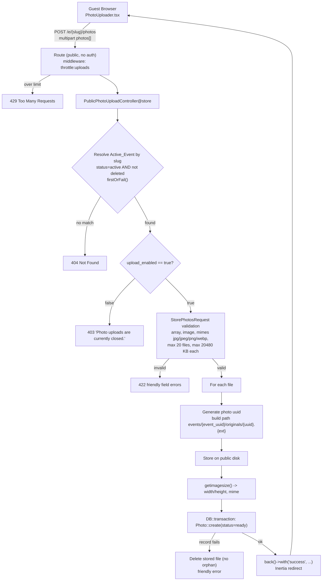

# Design Document

## Overview

This design implements **Phase 5** of MomentGather: unauthenticated **guest photo upload** to an event. An attendee scans the event QR code, lands on the existing public page (`GET /e/{slug}`), selects photos, and uploads them. No account, login, session, email, or password is involved.

Key decisions (fixed by requirements and grounded in the existing codebase):

- **No authentication.** The upload endpoint lives outside the `auth`/`verified` middleware group, exactly like the existing `GET /e/{slug}` route.
- **Public disk storage.** Files are stored via `Storage::disk('public')` (`config/filesystems.php` → `disks.public` → `storage/app/public`) at the server-built path `events/{event_uuid}/originals/{photo_uuid}.{ext}`. Web-serving requires the one-time `php artisan storage:link` (documented, not automated here). Tests use `Storage::fake('public')`.
- **Dimensions via `getimagesize()`.** No image-processing package is added. `getimagesize()` reads the file header to return width/height and a MIME type; **it does not require the `gd` or `imagick` extension** (it parses bytes directly). This matters because the target environment does **not** have `gd` enabled — runtime dimension extraction works regardless.
- **Original stored unchanged.** No resize, no conversion, no thumbnails, no queue/job, no cloud, no gallery UI. Strictly the basic upload flow.
- **Server-authoritative posture.** Event association, storage path/filename, MIME type, and `status` are all determined by the server. Client-supplied values for these are ignored.
- **New dependencies: none.** All artifacts use Laravel, Inertia v3, React 19, and shadcn/ui components already present.

Delivered artifacts: one `photos` migration, a `Photo` model, an `Event::photos()` relationship, `config/uploads.php`, a named rate limiter in `AppServiceProvider`, one public route, a `StorePhotosRequest` form request, a dedicated `PublicPhotoUploadController`, a small payload tweak to `PublicEventController@show`, a new `PhotoUploader.tsx` component plus an edit to `Public/Event.tsx`, the `PublicEvent` TypeScript type update, and feature tests with committed image fixtures.

## Architecture

The upload flows through a single dedicated controller action. Eligibility, validation, storage, and persistence all happen server-side before any success is reported.



Notes:

- The named limiter `uploads` is registered in `AppServiceProvider::boot()` (this skeleton has **no** `RouteServiceProvider`; providers are declared in `bootstrap/providers.php`). The route attaches it with `->middleware('throttle:uploads')`.
- Event resolution reuses the exact visibility rule from `PublicEventController@show` (`where('slug', ...)->where('status', 'active')->firstOrFail()`), so `SoftDeletes` auto-excludes deleted rows and non-active/nonexistent slugs yield 404.
- The response is an Inertia redirect (`back()->with(...)`) so that on the client, `useForm`'s `onSuccess` fires and `errors` is populated on validation failure. No raw JSON exception is returned to the attendee.

## Components and Interfaces

### Route (`routes/web.php`)

Added immediately after the existing public `show` route, still **outside** the auth group:

```php
use App\Http\Controllers\PublicPhotoUploadController;

// Public attendee-facing event page. No authentication.
Route::get('/e/{slug}', [PublicEventController::class, 'show'])
    ->name('public.events.show');

// Public guest photo upload. No authentication. Rate-limited by IP.
Route::post('/e/{slug}/photos', [PublicPhotoUploadController::class, 'store'])
    ->middleware('throttle:uploads')
    ->name('public.events.photos.store');
```

### Config (`config/uploads.php`)

New file centralizing the tunable limits (Requirement 16.3 — configurable, not hard-coded inline):

```php
<?php

return [
    // Upload requests allowed per minute per client IP.
    'rate_limit'  => (int) env('UPLOAD_RATE_LIMIT', 10),

    // Maximum number of files accepted in one request.
    'max_files'   => (int) env('UPLOAD_MAX_FILES', 20),

    // Maximum size per file in kilobytes (20 MB).
    'max_file_kb' => (int) env('UPLOAD_MAX_FILE_KB', 20480),
];
```

### Rate limiter (`app/Providers/AppServiceProvider.php`)

Registered in `boot()` alongside the existing defaults. Keyed by client IP; the per-minute count comes from config:

```php
use Illuminate\Cache\RateLimiting\Limit;
use Illuminate\Http\Request;
use Illuminate\Support\Facades\RateLimiter;

// inside boot(), after $this->configureDefaults();
RateLimiter::for('uploads', fn (Request $request) => Limit::perMinute(
    (int) config('uploads.rate_limit', 10)
)->by($request->ip()));
```

When the limit is exceeded, Laravel's `throttle` middleware returns HTTP 429 automatically.

### Form Request (`app/Http/Requests/StorePhotosRequest.php`)

Follows the existing `StoreEventRequest` convention (`authorize()` returns `true`; there is no authenticated user or policy for guests). Rules enforce array shape, count, per-file size, supported formats, and **real image validity**:

```php
<?php

namespace App\Http\Requests;

use Illuminate\Foundation\Http\FormRequest;

class StorePhotosRequest extends FormRequest
{
    public function authorize(): bool
    {
        // Public endpoint: no authentication required. Eligibility
        // (active event, upload_enabled) is enforced in the controller.
        return true;
    }

    /**
     * @return array<string, \Illuminate\Contracts\Validation\ValidationRule|array<mixed>|string>
     */
    public function rules(): array
    {
        return [
            'photos'   => ['required', 'array', 'max:'.config('uploads.max_files')],
            'photos.*' => [
                'required',
                'file',
                'image', // server-side content inspection (getimagesize under the hood)
                'mimes:jpg,jpeg,png,webp',
                'max:'.config('uploads.max_file_kb'),
            ],
        ];
    }

    /**
     * @return array<string, string>
     */
    public function messages(): array
    {
        return [
            'photos.required'   => 'Please select at least one photo to upload.',
            'photos.array'      => 'Please select at least one photo to upload.',
            'photos.max'        => 'You can upload up to :max photos at a time.',
            'photos.*.image'    => 'One of the selected files is not a valid image.',
            'photos.*.mimes'    => 'Photos must be JPG, PNG, or WEBP files.',
            'photos.*.max'      => 'Each photo must be 20 MB or smaller.',
            'photos.*.required' => 'One of the selected files could not be read.',
        ];
    }
}
```

The `image` rule validates that the file is a genuine, decodable image by inspecting content (Laravel uses the file's guessed extension/`getimagesize`), independent of the browser-reported MIME. The `mimes` rule constrains the validated type to the supported set. Together they satisfy content-based validation (Requirement 6.2, 6.5, 6.6). Messages are friendly and contain no paths, stack traces, or DB details (Requirement 6.7, 15.4).

### Controller (`app/Http/Controllers/PublicPhotoUploadController.php`)

A dedicated single-action controller keeps public photo logic separate from `PublicEventController`. It re-resolves the event with the exact same active-only query, enforces `upload_enabled`, then stores each file with orphan-cleanup safety:

```php
<?php

namespace App\Http\Controllers;

use App\Http\Requests\StorePhotosRequest;
use App\Models\Event;
use App\Models\Photo;
use Illuminate\Http\RedirectResponse;
use Illuminate\Support\Facades\DB;
use Illuminate\Support\Facades\Storage;
use Illuminate\Support\Str;

class PublicPhotoUploadController extends Controller
{
    /**
     * Accept guest photo uploads for an active, upload-enabled event.
     *
     * All trust-sensitive values (event association, storage path/filename,
     * mime type, status) are server-determined. Client-supplied event id,
     * path, filename, mime, and status are ignored.
     */
    public function store(StorePhotosRequest $request, string $slug): RedirectResponse
    {
        // Same visibility rule as PublicEventController@show. Nonexistent,
        // non-active, and soft-deleted slugs all yield 404 via firstOrFail().
        $event = Event::query()
            ->where('slug', $slug)
            ->where('status', 'active')
            ->firstOrFail();

        // Eligibility: uploads must be explicitly enabled. Friendly 403.
        abort_if(! $event->upload_enabled, 403, 'Photo uploads are currently closed.');

        foreach ($request->file('photos') as $file) {
            $uuid = (string) Str::uuid();
            $ext  = strtolower($file->getClientOriginalExtension() ?: $file->extension());
            $path = "events/{$event->uuid}/originals/{$uuid}.{$ext}";

            // Store the original, unchanged, under the server-built path.
            Storage::disk('public')->putFileAs(
                "events/{$event->uuid}/originals",
                $file,
                "{$uuid}.{$ext}"
            );

            // Dimensions + server-detected mime from the stored file's bytes.
            // getimagesize() reads headers and does NOT require gd/imagick.
            $absolute        = Storage::disk('public')->path($path);
            $size            = @getimagesize($absolute);
            $width           = $size[0] ?? null;
            $height          = $size[1] ?? null;
            $mime            = $size['mime'] ?? $file->getMimeType();

            try {
                DB::transaction(function () use ($event, $uuid, $file, $path, $mime, $width, $height): void {
                    Photo::create([
                        'event_id'          => $event->id,           // from slug, never body
                        'uuid'              => $uuid,
                        'original_filename' => $file->getClientOriginalName(), // display only
                        'original_path'     => $path,                // server-built
                        'mime_type'         => $mime,                // server-detected
                        'file_size'         => $file->getSize(),
                        'width'             => $width,
                        'height'            => $height,
                        'status'            => Photo::STATUS_READY,  // server-forced
                    ]);
                });
            } catch (\Throwable $e) {
                // Record creation failed after the file was stored: remove the
                // orphaned file so no dangling bytes remain, then surface a
                // friendly error with no internal details.
                Storage::disk('public')->delete($path);

                return back()
                    ->withErrors(['photos' => 'We could not save your photos. Please try again.'])
                    ->withInput();
            }
        }

        return back()->with('success', 'Your photos have been added to the event!');
    }
}
```

Behavior mapping:

- **404** — `firstOrFail()` on the active-only query (Requirement 7.2).
- **403** — `abort_if(! upload_enabled, 403, 'Photo uploads are currently closed.')` (Requirement 7.3). Laravel renders this as an Inertia error the uploader surfaces as friendly text.
- **Orphan cleanup** — if `Photo::create` throws after the file is stored, the stored file is deleted (Requirement 9.3). If `putFileAs` itself throws, no `Photo::create` runs, so no record exists (Requirement 9.4).
- **No leakage** — only friendly strings are returned; exceptions are caught and converted (Requirement 15.4).

### `Public/Event.tsx` payload (`PublicEventController@show`)

The uploader posts to `/e/{slug}/photos`, so the page needs `slug`. Add exactly one field to the narrow payload; all other fields stay as-is:

```php
$payload = [
    'name'           => $event->name,
    'description'    => $event->description,
    'event_date'     => $event->event_date?->toDateString(),
    'location'       => $event->location,
    'upload_enabled' => $event->upload_enabled,
    'slug'           => $event->slug, // needed by PhotoUploader to build the POST URL
];
```

`slug` is not organizer-private (it is already in the URL), so exposing it is safe.

### `PhotoUploader.tsx` (new, `resources/js/components/PhotoUploader.tsx`)

Mobile-first component using Inertia `useForm` with `forceFormData`. It manages selected files with object-URL thumbnails, supports individual removal, shows progress, disables during submission, and renders friendly errors and a success message.

```tsx
import { useForm } from '@inertiajs/react';
import { useEffect, useRef, useState } from 'react';
import { X } from 'lucide-react';

import { Button } from '@/components/ui/button';

interface Props {
    slug: string;
}

interface Preview {
    file: File;
    url: string; // object URL for thumbnail
}

export default function PhotoUploader({ slug }: Props) {
    const [previews, setPreviews] = useState<Preview[]>([]);
    const [succeeded, setSucceeded] = useState(false);
    const inputRef = useRef<HTMLInputElement>(null);

    const { setData, post, processing, progress, errors, reset } = useForm<{ photos: File[] }>({
        photos: [],
    });

    // Revoke all object URLs on unmount to avoid leaks.
    useEffect(() => {
        return () => previews.forEach((p) => URL.revokeObjectURL(p.url));
        // eslint-disable-next-line react-hooks/exhaustive-deps
    }, []);

    function syncForm(next: Preview[]) {
        setPreviews(next);
        setData('photos', next.map((p) => p.file));
    }

    function handleSelect(e: React.ChangeEvent<HTMLInputElement>) {
        const files = Array.from(e.target.files ?? []);
        const added = files.map((file) => ({ file, url: URL.createObjectURL(file) }));
        syncForm([...previews, ...added]);
        setSucceeded(false);
        e.target.value = ''; // allow re-selecting the same file
    }

    function removeAt(index: number) {
        URL.revokeObjectURL(previews[index].url);
        syncForm(previews.filter((_, i) => i !== index));
    }

    function submit() {
        post(`/e/${slug}/photos`, {
            forceFormData: true,
            preserveScroll: true,
            onSuccess: () => {
                previews.forEach((p) => URL.revokeObjectURL(p.url));
                setPreviews([]);
                reset('photos');
                setSucceeded(true);
            },
        });
    }

    return (
        <div className="flex flex-col gap-4">
            <div className="flex flex-col gap-1 text-center">
                <h2 className="text-lg font-semibold text-foreground">Share Your Moments</h2>
                <p className="text-sm text-muted-foreground">
                    Select photos from your device and add them to this event.
                </p>
            </div>

            <input
                ref={inputRef}
                type="file"
                accept="image/jpeg,image/png,image/webp"
                multiple
                className="hidden"
                onChange={handleSelect}
            />

            <Button size="lg" variant="outline" className="w-full" onClick={() => inputRef.current?.click()}>
                Select Photos
            </Button>

            {previews.length > 0 && (
                <ul className="grid grid-cols-3 gap-2">
                    {previews.map((p, i) => (
                        <li key={p.url} className="relative">
                            
                            <button
                                type="button"
                                aria-label="Remove photo"
                                onClick={() => removeAt(i)}
                                className="absolute -top-2 -right-2 rounded-full bg-background p-1 shadow"
                            >
                                <X className="h-4 w-4" />
                            </button>
                        </li>
                    ))}
                </ul>
            )}

            {/* Friendly validation errors from the server error bag. */}
            {Object.values(errors).length > 0 && (
                <div className="text-center text-sm text-destructive">
                    {Object.values(errors).map((message, i) => (
                        <p key={i}>{message}</p>
                    ))}
                </div>
            )}

            {previews.length > 0 && (
                <Button size="lg" className="w-full" disabled={processing} onClick={submit}>
                    {processing
                        ? `Uploading${progress ? ` ${progress.percentage}%` : ''}…`
                        : 'Upload Photos'}
                </Button>
            )}

            {succeeded && (
                <p className="text-center text-sm text-foreground">
                    Your photos have been added to the event!
                </p>
            )}
        </div>
    );
}
```

Notes:

- No personal/contact fields (Requirement 12.5).
- The "Upload Photos" control only appears once files are selected (Requirement 12.3); it is disabled while `processing` (Requirement 14.2).
- Progress uses Inertia's `progress.percentage` (Requirement 14.1).
- Object URLs are revoked on remove, on success, and on unmount to prevent leaks (Requirement 13).

### `Public/Event.tsx` edit

Replace the placeholder Upload Photos button with the uploader when enabled; keep the closed message otherwise; keep the View Gallery placeholder:

```tsx
import PhotoUploader from '@/components/PhotoUploader';
// ...
{event.upload_enabled ? (
    <PhotoUploader slug={event.slug} />
) : (
    <p className="text-center text-sm text-muted-foreground">
        Photo uploads are currently closed.
    </p>
)}
<Button size="lg" variant="outline" className="w-full">
    View Gallery
</Button>
```

### `PublicEvent` type (`resources/js/types/models.ts`)

Add `slug` to the interface:

```ts
export interface PublicEvent {
    name: string;
    description: string | null;
    event_date: string | null;
    location: string | null;
    upload_enabled: boolean;
    slug: string;
}
```

## Data Models

### `photos` migration

New migration `..._create_photos_table.php` mirroring `events` conventions:

```php
<?php

use Illuminate\Database\Migrations\Migration;
use Illuminate\Database\Schema\Blueprint;
use Illuminate\Support\Facades\Schema;

return new class extends Migration
{
    public function up(): void
    {
        Schema::create('photos', function (Blueprint $table) {
            $table->id();
            $table->foreignId('event_id')->constrained()->cascadeOnDelete()->index();
            $table->char('uuid', 36)->unique();
            $table->string('original_filename', 255);
            $table->string('original_path', 512);
            $table->string('mime_type', 100);
            $table->unsignedBigInteger('file_size'); // bytes
            $table->unsignedInteger('width')->nullable();
            $table->unsignedInteger('height')->nullable();
            $table->string('status', 20)->default('ready')->index();
            $table->timestamps();
            $table->softDeletes();
        });
    }

    public function down(): void
    {
        Schema::dropIfExists('photos');
    }
};
```

### `Photo` model (`app/Models/Photo.php`)

```php
<?php

namespace App\Models;

use Database\Factories\PhotoFactory;
use Illuminate\Database\Eloquent\Attributes\Fillable;
use Illuminate\Database\Eloquent\Factories\HasFactory;
use Illuminate\Database\Eloquent\Model;
use Illuminate\Database\Eloquent\Relations\BelongsTo;
use Illuminate\Database\Eloquent\SoftDeletes;
use Illuminate\Support\Str;

/**
 * @property int $id
 * @property int $event_id
 * @property string $uuid
 * @property string $original_filename
 * @property string $original_path
 * @property string $mime_type
 * @property int $file_size
 * @property int|null $width
 * @property int|null $height
 * @property string $status
 * @property \Illuminate\Support\Carbon|null $deleted_at
 */
#[Fillable([
    'event_id', 'uuid', 'original_filename', 'original_path',
    'mime_type', 'file_size', 'width', 'height', 'status',
])]
class Photo extends Model
{
    /** @use HasFactory<PhotoFactory> */
    use HasFactory, SoftDeletes;

    public const STATUS_PENDING    = 'pending';
    public const STATUS_PROCESSING = 'processing';
    public const STATUS_READY      = 'ready';
    public const STATUS_FAILED     = 'failed';
    public const STATUS_DELETED    = 'deleted';

    /**
     * @return array<string, string>
     */
    protected function casts(): array
    {
        return [
            'file_size'  => 'integer',
            'width'      => 'integer',
            'height'     => 'integer',
            'deleted_at' => 'datetime',
        ];
    }

    protected static function booted(): void
    {
        static::creating(function (Photo $photo): void {
            if (empty($photo->uuid)) {
                $photo->uuid = (string) Str::uuid();
            }
        });
    }

    public function event(): BelongsTo
    {
        return $this->belongsTo(Event::class);
    }
}
```

The status constants (Requirement 4.3) exist for current and future phases; this phase only ever sets `STATUS_READY`.

### `Event::photos()` relationship (`app/Models/Event.php`)

Add the inverse `hasMany`:

```php
use Illuminate\Database\Eloquent\Relations\HasMany;

public function photos(): HasMany
{
    return $this->hasMany(Photo::class);
}
```

### `PhotoFactory` (`database/factories/PhotoFactory.php`)

For tests that need photos directly (defaults reflect a successful upload):

```php
<?php

namespace Database\Factories;

use App\Models\Event;
use App\Models\Photo;
use Illuminate\Database\Eloquent\Factories\Factory;
use Illuminate\Support\Str;

/**
 * @extends Factory<Photo>
 */
class PhotoFactory extends Factory
{
    protected $model = Photo::class;

    public function definition(): array
    {
        $uuid = (string) Str::uuid();

        return [
            'event_id'          => Event::factory(),
            'uuid'              => $uuid,
            'original_filename' => $this->faker->word().'.jpg',
            'original_path'     => "events/".Str::uuid()."/originals/{$uuid}.jpg",
            'mime_type'         => 'image/jpeg',
            'file_size'         => $this->faker->numberBetween(1000, 5_000_000),
            'width'             => 800,
            'height'            => 600,
            'status'            => Photo::STATUS_READY,
        ];
    }
}
```

## Correctness Properties

*A property is a characteristic or behavior that should hold true across all valid executions of a system—essentially, a formal statement about what the system should do. Properties serve as the bridge between human-readable specifications and machine-verifiable correctness guarantees.*

Property-based testing applies here because the upload flow is server logic whose outcome varies meaningfully with input (formats, sizes, counts, arbitrary client-supplied fields, event states). The following properties are the consolidated set produced by the prework analysis (redundant criteria merged as noted).

### Property 1: Unauthenticated acceptance

*For any* Uploadable_Event and any valid set of supported image files, an upload request carrying no credentials, session, email, or password SHALL be accepted (not redirected to authentication) and SHALL persist the photos.

**Validates: Requirements 1.1, 1.3, 1.4**

### Property 2: Eligibility acceptance soundness

*For any* event resolved by slug, the upload SHALL be accepted if and only if the event is active, not soft-deleted, and has `upload_enabled = true`.

**Validates: Requirements 7.1, 7.4**

### Property 3: Non-active resolution yields 404

*For any* slug that does not resolve to an Active_Event (nonexistent, draft, archived, or soft-deleted), the upload request SHALL respond with HTTP 404.

**Validates: Requirements 7.2**

### Property 4: Disabled uploads yield 403

*For any* Active_Event whose `upload_enabled = false`, the upload request SHALL respond with HTTP 403 and the message "Photo uploads are currently closed.".

**Validates: Requirements 7.3**

### Property 5: Validation soundness

*For any* upload request, the request SHALL be accepted if and only if `photos` is a non-empty array of at most Max_Photos_Per_Request (20) files where every file is a decodable image of a Supported_Format (JPG, JPEG, PNG, WEBP) not exceeding Max_Photo_Size (20 MB); otherwise the request SHALL be rejected with HTTP 422 and friendly messages.

**Validates: Requirements 6.1, 6.2, 6.3, 6.4, 6.5, 6.6**

### Property 6: Server-authoritative event association

*For any* upload to a slug-resolved Uploadable_Event, and *for any* `event_id` value supplied in the request body, every created Photo's `event_id` SHALL equal the id of the slug-resolved Event and the Event's `photos` relationship SHALL contain that Photo.

**Validates: Requirements 3.3, 3.6, 5.2, 5.3, 17.1, 18.2**

### Property 7: Storage-path invariant

*For any* accepted file, the stored file SHALL exist on the Public_Disk at exactly `events/{event_uuid}/originals/{photo_uuid}.{ext}`, the `original_path` SHALL equal that path, the stored filename component SHALL equal `{photo_uuid}.{ext}` and SHALL NOT equal the client's original filename, regardless of any client-supplied path or filename.

**Validates: Requirements 8.1, 8.2, 8.3, 8.4, 17.2**

### Property 8: Status invariant

*For any* successful upload and *for any* `status` value supplied in the request body, the created Photo's persisted `status` SHALL equal `ready`.

**Validates: Requirements 4.1, 4.2, 17.4, 18.1**

### Property 9: Server-detected MIME type

*For any* accepted file, the created Photo's `mime_type` SHALL be derived from server-side inspection of the stored file's content and SHALL NOT be taken from the browser-reported MIME type.

**Validates: Requirements 9.2, 17.3**

### Property 10: Dimension correctness

*For any* accepted image, the created Photo's `width` and `height` SHALL equal the dimensions returned by `getimagesize()` for that image.

**Validates: Requirements 10.1, 10.2**

### Property 11: Original preserved

*For any* accepted file, the created Photo's `original_filename` SHALL equal the client's original filename, and the stored file's bytes SHALL be identical to the uploaded file's bytes (no resize or modification).

**Validates: Requirements 9.1, 10.3**

### Property 12: Orphan-cleanup atomicity

*For any* accepted file, if creating the Photo record fails after the file has been stored, THEN the stored file SHALL be deleted so that no orphaned file remains; and if storing the file fails, THEN no Photo record SHALL be created for that file.

**Validates: Requirements 9.3, 9.4**

### Property 13: UUID generation and uniqueness

*For any* Photo created without a supplied `uuid`, a UUID SHALL be generated before persistence, and *for any* set of created Photos, all `uuid` values SHALL be unique.

**Validates: Requirements 3.4**

### Property 14: Rate limiting

*For any* client IP issuing more than Upload_Rate_Limit (10) upload requests within one minute, the requests beyond the limit SHALL respond with HTTP 429.

**Validates: Requirements 16.1, 16.2**

## Error Handling

All error responses are friendly and free of stack traces, filesystem paths, database errors, and internal exception details (Requirement 15.4).

| Condition | Detection | HTTP status | Attendee-facing result |
|---|---|---|---|
| Slug nonexistent / draft / archived / soft-deleted | `firstOrFail()` on active-only query | 404 | Standard "not found" page; uploader shows unavailable message |
| Event active but `upload_enabled = false` | `abort_if(! upload_enabled, 403, ...)` | 403 | "Photo uploads are currently closed." |
| Invalid type / oversize / too many / non-image | `StorePhotosRequest` validation | 422 | Friendly field messages surfaced from `errors` bag |
| Storage write fails | `putFileAs` throws; no record created | 302 back w/ error | "We could not save your photos. Please try again." |
| DB record creation fails after store | caught `\Throwable`; stored file deleted | 302 back w/ error | "We could not save your photos. Please try again." |
| Over rate limit | `throttle:uploads` middleware | 429 | Friendly "too many requests" (uploader shows failure message) |

Because responses are Inertia redirects/validation errors, the `PhotoUploader` surfaces them through `useForm`'s `errors` bag (validation and controller `withErrors`) and standard Inertia error handling (403/404/429), satisfying Requirements 15.1–15.3.

## Testing Strategy

Tests live in `tests/Feature/GuestPhotoUploadTest.php`, using PHPUnit `#[Test]` attributes, `RefreshDatabase`, in-memory SQLite, `Storage::fake('public')`, and `Inertia\Testing\AssertableInertia` where page props matter. They realize the property/example strategies from the prework and directly satisfy Requirement 19.

### Handling the gd-less environment (critical)

The target environment has **no `gd` extension** enabled. Two consequences shape the test strategy:

1. **Runtime is fine.** `getimagesize()` reads file headers directly and does **not** require `gd` or `imagick`. Dimension extraction (Property 10) works in production and in tests without any extension.
2. **`UploadedFile::fake()->image()` does NOT work without gd**, because it synthesizes a PNG/JPEG using `gd`. Tests MUST NOT rely on it.

**Fixture-based approach.** Commit real, tiny valid image files under `tests/Fixtures/`:

- `tests/Fixtures/sample.jpg`
- `tests/Fixtures/sample.jpeg`
- `tests/Fixtures/sample.png`
- `tests/Fixtures/sample.webp`
- `tests/Fixtures/not-an-image.jpg` (text bytes with a `.jpg` name — a genuinely invalid image)

Load a real fixture as an `UploadedFile` in test mode (last arg `true` skips move-safety and marks it valid), which needs no `gd`:

```php
private function fixture(string $name, string $mime): \Illuminate\Http\UploadedFile
{
    $path = base_path("tests/Fixtures/{$name}");

    return new \Illuminate\Http\UploadedFile($path, $name, $mime, null, true);
}
```

- **Format acceptance/rejection, dimensions, original bytes** use these real fixtures — deterministic and gd-independent.
- **Too-many-files** duplicates a small real fixture 21 times (count validation triggers before content matters).
- **Oversize** — committing a real >20 MB image is impractical. Use `UploadedFile::fake()->create('big.jpg', 21000, 'image/jpeg')` (`create()` does not require `gd`). Because the `image` rule may also flag a non-decodable `create()` file, the test asserts only that the request is **rejected with 422** (either the `max` or `image` message is acceptable) — the observable behavior required by Requirement 6.4 is rejection, not the specific rule.
- **Invalid image** uses `not-an-image.jpg` and asserts 422 via the `image` rule.

### Representative test cases

```php
<?php

namespace Tests\Feature;

use App\Models\Event;
use App\Models\Photo;
use Illuminate\Foundation\Testing\RefreshDatabase;
use Illuminate\Http\UploadedFile;
use Illuminate\Support\Facades\Storage;
use PHPUnit\Framework\Attributes\Test;
use Tests\TestCase;

class GuestPhotoUploadTest extends TestCase
{
    use RefreshDatabase;

    private function uploadableEvent(array $overrides = []): Event
    {
        return Event::factory()->create(array_merge([
            'status'         => 'active',
            'upload_enabled' => true,
        ], $overrides));
    }

    private function fixture(string $name, string $mime): UploadedFile
    {
        return new UploadedFile(base_path("tests/Fixtures/{$name}"), $name, $mime, null, true);
    }

    // Property 1: unauthenticated guest can upload; Property 7 & 8 & 11.
    #[Test]
    public function guest_can_upload_and_photo_is_persisted_correctly(): void
    {
        Storage::fake('public');
        $event = $this->uploadableEvent();

        $this->post("/e/{$event->slug}/photos", [
            'photos' => [$this->fixture('sample.jpg', 'image/jpeg')],
        ])->assertRedirect();

        $photo = Photo::firstOrFail();
        $this->assertSame($event->id, $photo->event_id);          // Property 6
        $this->assertNotEmpty($photo->uuid);                       // Property 13
        $this->assertSame('sample.jpg', $photo->original_filename); // Property 11
        $this->assertSame(Photo::STATUS_READY, $photo->status);    // Property 8
        $expected = "events/{$event->uuid}/originals/{$photo->uuid}.jpg";
        $this->assertSame($expected, $photo->original_path);       // Property 7
        $this->assertNotSame('sample.jpg', "{$photo->uuid}.jpg");  // filename distinct
        Storage::disk('public')->assertExists($expected);          // Property 7
    }

    // Property 5: each supported format accepted.
    #[Test]
    public function each_supported_format_is_accepted(): void
    {
        Storage::fake('public');
        $event = $this->uploadableEvent();

        foreach ([['sample.jpg', 'image/jpeg'], ['sample.png', 'image/png'], ['sample.webp', 'image/webp']] as [$n, $m]) {
            $this->post("/e/{$event->slug}/photos", ['photos' => [$this->fixture($n, $m)]])
                ->assertRedirect()->assertSessionHasNoErrors();
        }
    }

    // Property 5: unsupported format rejected.
    #[Test]
    public function unsupported_format_is_rejected(): void
    {
        Storage::fake('public');
        $event = $this->uploadableEvent();

        $this->post("/e/{$event->slug}/photos", [
            'photos' => [UploadedFile::fake()->create('doc.pdf', 100, 'application/pdf')],
        ])->assertSessionHasErrors('photos.0');
    }

    // Property 5: invalid (non-decodable) image rejected.
    #[Test]
    public function invalid_image_is_rejected(): void
    {
        Storage::fake('public');
        $event = $this->uploadableEvent();

        $this->post("/e/{$event->slug}/photos", [
            'photos' => [$this->fixture('not-an-image.jpg', 'image/jpeg')],
        ])->assertSessionHasErrors('photos.0');
    }

    // Property 5: oversize rejected (422, either max or image rule).
    #[Test]
    public function oversize_file_is_rejected(): void
    {
        Storage::fake('public');
        $event = $this->uploadableEvent();

        $this->post("/e/{$event->slug}/photos", [
            'photos' => [UploadedFile::fake()->create('big.jpg', 21000, 'image/jpeg')],
        ])->assertSessionHasErrors('photos.0');
    }

    // Property 5: too many files rejected.
    #[Test]
    public function too_many_files_are_rejected(): void
    {
        Storage::fake('public');
        $event = $this->uploadableEvent();
        $files = array_fill(0, 21, $this->fixture('sample.jpg', 'image/jpeg'));

        $this->post("/e/{$event->slug}/photos", ['photos' => $files])
            ->assertSessionHasErrors('photos');
    }

    // Property 4: upload_enabled = false -> 403.
    #[Test]
    public function disabled_uploads_return_403(): void
    {
        Storage::fake('public');
        $event = $this->uploadableEvent(['upload_enabled' => false]);

        $this->post("/e/{$event->slug}/photos", [
            'photos' => [$this->fixture('sample.jpg', 'image/jpeg')],
        ])->assertForbidden();
    }

    // Property 3: draft / archived / soft-deleted -> 404.
    #[Test]
    public function non_active_events_return_404(): void
    {
        Storage::fake('public');

        $draft    = Event::factory()->create(['status' => 'draft']);
        $archived = Event::factory()->create(['status' => 'archived']);
        $deleted  = $this->uploadableEvent();
        $deleted->delete();

        foreach ([$draft, $archived, $deleted] as $event) {
            $this->post("/e/{$event->slug}/photos", [
                'photos' => [$this->fixture('sample.jpg', 'image/jpeg')],
            ])->assertNotFound();
        }
    }

    // Property 6, 7, 8: client cannot override event_id, path, or status.
    #[Test]
    public function client_supplied_trust_values_are_ignored(): void
    {
        Storage::fake('public');
        $target = $this->uploadableEvent();
        $other  = $this->uploadableEvent();

        $this->post("/e/{$target->slug}/photos", [
            'photos'        => [$this->fixture('sample.jpg', 'image/jpeg')],
            'event_id'      => $other->id,
            'status'        => 'failed',
            'original_path' => '../../etc/evil.jpg',
        ])->assertRedirect();

        $photo = Photo::firstOrFail();
        $this->assertSame($target->id, $photo->event_id);
        $this->assertSame(Photo::STATUS_READY, $photo->status);
        $this->assertSame("events/{$target->uuid}/originals/{$photo->uuid}.jpg", $photo->original_path);
    }

    // Property 14: over the rate limit -> 429.
    #[Test]
    public function exceeding_rate_limit_returns_429(): void
    {
        Storage::fake('public');
        $event = $this->uploadableEvent();

        for ($i = 0; $i < 10; $i++) {
            $this->post("/e/{$event->slug}/photos", [
                'photos' => [$this->fixture('sample.jpg', 'image/jpeg')],
            ]);
        }

        $this->post("/e/{$event->slug}/photos", [
            'photos' => [$this->fixture('sample.jpg', 'image/jpeg')],
        ])->assertStatus(429);
    }
}
```

### Property-based vs example tests

- **Property-based tests** should be written for Properties 5–13 using a PHP PBT library (e.g. a `for`-driven data provider or a property library) with **minimum 100 iterations** where randomization adds value (arbitrary client body values for Properties 6/8, arbitrary counts/sizes/formats for Property 5). Each such test carries a comment tag: `// Feature: guest-photo-upload, Property N: {property text}`. For content-dependent properties (7, 10, 11), iterate over the committed fixture set rather than synthesized images, since `gd` is unavailable.
- **Example/integration tests** cover: route registration and no-auth reachability (Requirement 1.2, SMOKE), config-driven limiter (Requirement 16.3, SMOKE), soft-delete behavior, and response-body leakage checks (Requirement 15.4) asserting 403/404/422/429 bodies contain no filesystem paths or exception class names.

### Manual / structural verification (frontend)

Requirements 11–15 client behaviors (multi-select, selected-file list, per-file removal, object-URL previews, progress percentage, disable-while-processing, headings/copy, friendly error rendering) are React/DOM/UX concerns not amenable to backend PBT. Verify by structural review of `PhotoUploader.tsx` against the criteria and by manual exercise in a browser.

### One-time setup note

Serving stored files over the web requires running `php artisan storage:link` once in each environment. This is operational setup, not covered by feature tests (tests use `Storage::fake('public')`).
