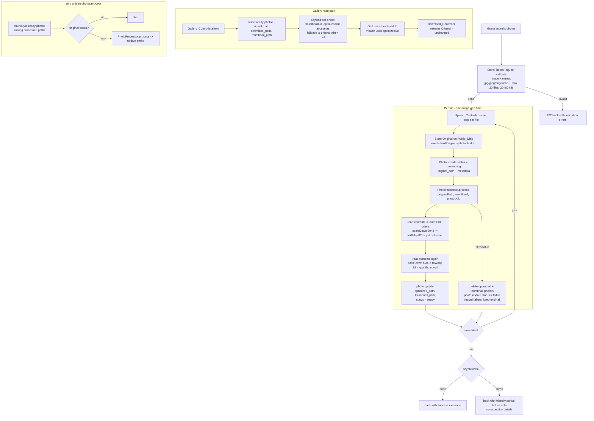

# Design Document

## Overview

Phase 7 adds **synchronous, local image processing** to the guest photo upload flow of MomentGather. When a guest uploads photos to an active event, the System now — inside the same request — preserves the original, generates a WebP **optimized** image (max dimension 2048px) and a WebP **thumbnail** (max dimension 500px), records their storage paths, and marks the photo `ready` only when both processed files are written. On failure the photo is marked `failed`, partial processed files are removed, and a friendly message is returned. The gallery grid then loads thumbnails, the full-screen viewer loads optimized images, and the download endpoint continues to serve the untouched original.

### Design decisions

- **Image library**: `intervention/image` v3 with the **GD driver**, instantiated directly (no Laravel wrapper). One image package total.
- **Environment requirement (documented, not silently changed)**: PHP `gd` and `exif` extensions plus GD WebP support are required and have been enabled/verified in the local `php.ini` (`gd=yes`, `exif=yes`, `imagewebp` available). Production configuration is out of scope for this phase.
- **Memory (documented)**: Processing runs one image at a time within the upload loop. Large images (e.g. 20 MB, high-megapixel) can require substantial memory during decode. A PHP `memory_limit` note is documented rather than changing server config. Each variant is processed and its image instance released before the next to keep peak memory bounded.
- **Output format**: Optimized and thumbnail are always **WebP**. The original is kept **byte-for-byte** in its uploaded format (JPG/JPEG/PNG/WEBP).
- **EXIF orientation**: The GD driver auto-orients pixels on `read()`. Processed variants come out upright; the original is untouched.
- **Storage layout** (existing event-scoped `public` disk):
  - Original: `events/{event_uuid}/originals/{photo_uuid}.{ext}` (Phase 5, unchanged)
  - Optimized: `events/{event_uuid}/optimized/{photo_uuid}.webp`
  - Thumbnail: `events/{event_uuid}/thumbnails/{photo_uuid}.webp`
- **Synchronous only**: No queue/jobs/Redis/Horizon/S3/CDN. Background processing is deferred to Phase 8.
- **Schema**: One new migration adds nullable `optimized_path` and `thumbnail_path`. The existing photos migration is not edited. Legacy rows keep null processed paths and remain valid.
- **Legacy fallback**: Photo URL accessors fall back to the original URL when a processed path is null, so pre-Phase-7 photos still render.
- **Backfill**: An idempotent `php artisan photos:process` command generates processed versions for existing ready photos that lack them; it skips already-processed photos and photos whose original is missing, and never deletes records.

## Architecture



Key points:
- File writes are **not** transactional. The controller writes files first, then updates the DB row; on exception it cleans up processed partials and marks the row `failed`. The original is retained (a failed photo is simply excluded from the gallery).
- A single file failing does **not** abort the whole request. Each file is processed independently; failures are counted and reported as a friendly partial-success note.

## Components and Interfaces

### 1. Composer package

Install the sole image library:

```bash
composer require intervention/image:^3
```

No service provider or config publish is required — the manager is instantiated directly with the GD driver.

### 2. Migration — add nullable processed-path columns

New migration file (e.g. `database/migrations/2026_09_05_000000_add_processed_paths_to_photos_table.php`). The existing photos migration is **not** edited.

```php
<?php

use Illuminate\Database\Migrations\Migration;
use Illuminate\Database\Schema\Blueprint;
use Illuminate\Support\Facades\Schema;

return new class extends Migration
{
    public function up(): void
    {
        Schema::table('photos', function (Blueprint $table): void {
            $table->string('optimized_path', 512)->nullable()->after('original_path');
            $table->string('thumbnail_path', 512)->nullable()->after('optimized_path');
        });
    }

    public function down(): void
    {
        Schema::table('photos', function (Blueprint $table): void {
            $table->dropColumn(['optimized_path', 'thumbnail_path']);
        });
    }
};
```

### 3. Photo model — fillable + URL accessors with fallback

Add the two columns to `#[Fillable(...)]` and expose three plain URL methods (methods, not attribute casts, to avoid colliding with the fillable `optimized_path`/`thumbnail_path` columns). All URLs resolve through the `public` disk URL helper.

```php
use Illuminate\Support\Facades\Storage;

#[Fillable([
    'event_id', 'uuid', 'original_filename', 'original_path',
    'optimized_path', 'thumbnail_path',
    'mime_type', 'file_size', 'width', 'height', 'status',
])]
class Photo extends Model
{
    // ...existing constants, casts(), booted(), event()...

    public function originalUrl(): string
    {
        return Storage::disk('public')->url($this->original_path);
    }

    public function optimizedUrl(): string
    {
        return Storage::disk('public')->url($this->optimized_path ?? $this->original_path);
    }

    public function thumbnailUrl(): string
    {
        return Storage::disk('public')->url($this->thumbnail_path ?? $this->original_path);
    }
}
```

Add the new columns to the `@property` docblock (`string|null $optimized_path`, `string|null $thumbnail_path`).

### 4. `App\Services\PhotoProcessor` (new)

A testable service that reads a stored original from the `public` disk and writes the optimized + thumbnail WebP siblings. It returns the two relative paths and **throws** on any failure (the caller handles cleanup). Each variant is processed from a fresh `read()` so no mutation state leaks between variants, and each image instance is released before the next to bound memory.

```php
<?php

namespace App\Services;

use Illuminate\Support\Facades\Storage;
use Intervention\Image\Drivers\Gd\Driver;
use Intervention\Image\ImageManager;

class PhotoProcessor
{
    private const OPTIMIZED_MAX = 2048;
    private const THUMBNAIL_MAX = 500;
    private const WEBP_QUALITY  = 82;

    /**
     * Generate and store the optimized and thumbnail WebP variants for a
     * stored original. Returns the two public-disk relative paths.
     *
     * @return array{optimized_path: string, thumbnail_path: string}
     *
     * @throws \Throwable on decode, encode, or storage failure
     */
    public function process(string $originalPath, string $eventUuid, string $photoUuid): array
    {
        $disk    = Storage::disk('public');
        $manager = new ImageManager(new Driver());

        $optimizedPath = "events/{$eventUuid}/optimized/{$photoUuid}.webp";
        $thumbnailPath = "events/{$eventUuid}/thumbnails/{$photoUuid}.webp";

        // Read the source bytes once; decode fresh per variant to avoid
        // scaleDown mutation coupling. read() auto-applies EXIF orientation.
        $contents = $disk->get($originalPath);

        // Optimized (max dimension 2048, scale-down only, never upscales).
        $optimized = $manager->read($contents)
            ->scaleDown(width: self::OPTIMIZED_MAX, height: self::OPTIMIZED_MAX);
        $disk->put($optimizedPath, (string) $optimized->toWebp(quality: self::WEBP_QUALITY));
        unset($optimized);

        // Thumbnail (max dimension 500, scale-down only, never upscales).
        $thumbnail = $manager->read($contents)
            ->scaleDown(width: self::THUMBNAIL_MAX, height: self::THUMBNAIL_MAX);
        $disk->put($thumbnailPath, (string) $thumbnail->toWebp(quality: self::WEBP_QUALITY));
        unset($thumbnail);

        return [
            'optimized_path' => $optimizedPath,
            'thumbnail_path' => $thumbnailPath,
        ];
    }
}
```

Notes:
- `scaleDown()` is exactly the "scale down preserving aspect ratio, never upscale" operation, satisfying Requirements 4.1–4.3 and 5.1–5.3.
- Encoding to a string and using `Storage::disk('public')->put()` keeps the service compatible with `Storage::fake('public')` in tests (Requirement 12: no manual path concatenation).
- File names are derived from the server-supplied `$photoUuid` (Requirement 13).

### 5. Revised `PublicPhotoUploadController@store`

Per-file flow: store original (unchanged) → create `Photo` with `status = processing` → run `PhotoProcessor` → on success update paths + `status = ready`; on `Throwable` delete processed partials, mark `status = failed`, count the failure, and continue. The original is kept on failure. No exception details leak; a friendly partial-failure note is shown when any file fails.

```php
<?php

namespace App\Http\Controllers;

use App\Http\Requests\StorePhotosRequest;
use App\Models\Event;
use App\Models\Photo;
use App\Services\PhotoProcessor;
use Illuminate\Http\RedirectResponse;
use Illuminate\Support\Facades\Storage;
use Illuminate\Support\Str;

class PublicPhotoUploadController extends Controller
{
    public function store(StorePhotosRequest $request, string $slug, PhotoProcessor $processor): RedirectResponse
    {
        $event = Event::query()
            ->where('slug', $slug)
            ->where('status', 'active')
            ->firstOrFail();

        abort_if(! $event->upload_enabled, 403, 'Photo uploads are currently closed.');

        $disk     = Storage::disk('public');
        $failures = 0;

        foreach ($request->file('photos') as $file) {
            $uuid = (string) Str::uuid();
            $ext  = strtolower($file->getClientOriginalExtension() ?: $file->extension());
            $path = "events/{$event->uuid}/originals/{$uuid}.{$ext}";

            // 1. Store the original (unchanged from Phase 5).
            $disk->putFileAs("events/{$event->uuid}/originals", $file, "{$uuid}.{$ext}");

            $absolute = $disk->path($path);
            $size     = @getimagesize($absolute);
            $width    = $size[0] ?? null;
            $height   = $size[1] ?? null;
            $mime     = $size['mime'] ?? $file->getMimeType();

            // 2. Create the row in processing state.
            $photo = Photo::create([
                'event_id'          => $event->id,
                'uuid'              => $uuid,
                'original_filename' => $file->getClientOriginalName(),
                'original_path'     => $path,
                'mime_type'         => $mime,
                'file_size'         => $file->getSize(),
                'width'             => $width,
                'height'            => $height,
                'status'            => Photo::STATUS_PROCESSING,
            ]);

            // 3. Process, then mark ready — or clean up and mark failed.
            try {
                $paths = $processor->process($path, $event->uuid, $uuid);

                $photo->update([
                    'optimized_path' => $paths['optimized_path'],
                    'thumbnail_path' => $paths['thumbnail_path'],
                    'status'         => Photo::STATUS_READY,
                ]);
            } catch (\Throwable $e) {
                // Remove any partially generated processed files; keep original.
                $disk->delete([
                    "events/{$event->uuid}/optimized/{$uuid}.webp",
                    "events/{$event->uuid}/thumbnails/{$uuid}.webp",
                ]);

                $photo->update(['status' => Photo::STATUS_FAILED]);
                $failures++;
            }
        }

        if ($failures > 0) {
            return back()->with(
                'success',
                'Your photos were uploaded. Some could not be processed and were skipped.'
            );
        }

        return back()->with('success', 'Your photos have been added to the event!');
    }
}
```

Design note: a single file's processing failure marks only that photo `failed` and continues. The request still succeeds with a friendly note. This avoids losing the guest's other successfully processed photos and never surfaces exception details.

### 6. Revised `PublicGalleryController@show` payload

Select the new columns so accessors have their data, and emit `thumbnailUrl` + `optimizedUrl` (each with legacy fallback via the accessors). Ready-only filtering is unchanged, so failed photos are excluded automatically.

```php
$photos = $event->photos()
    ->where('status', Photo::STATUS_READY)
    ->orderByDesc('id')
    ->paginate(24, [
        'id', 'event_id', 'uuid',
        'original_path', 'optimized_path', 'thumbnail_path',
        'original_filename', 'width', 'height',
    ]);

$photos->through(fn (Photo $photo) => [
    'uuid'         => $photo->uuid,
    'thumbnailUrl' => $photo->thumbnailUrl(),
    'optimizedUrl' => $photo->optimizedUrl(),
    'filename'     => $photo->original_filename,
    'width'        => $photo->width,
    'height'       => $photo->height,
]);
```

`mime_type` is dropped from the payload (unused by the frontend); `width`/`height` are retained for aspect handling.

### 7. `App\Console\Commands\ProcessPhotos` (new) — `photos:process`

Idempotent backfill. Chunks ready photos that lack either processed path; skips photos whose original is missing; never deletes records.

```php
<?php

namespace App\Console\Commands;

use App\Models\Photo;
use App\Services\PhotoProcessor;
use Illuminate\Console\Command;
use Illuminate\Support\Facades\Storage;

class ProcessPhotos extends Command
{
    protected $signature   = 'photos:process';
    protected $description = 'Generate optimized and thumbnail WebP variants for ready photos that lack them.';

    public function handle(PhotoProcessor $processor): int
    {
        $disk      = Storage::disk('public');
        $processed = 0;
        $skipped   = 0;

        Photo::query()
            ->where('status', Photo::STATUS_READY)
            ->where(function ($q): void {
                $q->whereNull('optimized_path')->orWhereNull('thumbnail_path');
            })
            ->with('event:id,uuid')
            ->chunkById(50, function ($photos) use ($processor, $disk, &$processed, &$skipped): void {
                foreach ($photos as $photo) {
                    if (! $disk->exists($photo->original_path)) {
                        $this->warn("Skipping {$photo->uuid}: original missing.");
                        $skipped++;
                        continue;
                    }

                    $paths = $processor->process($photo->original_path, $photo->event->uuid, $photo->uuid);
                    $photo->update([
                        'optimized_path' => $paths['optimized_path'],
                        'thumbnail_path' => $paths['thumbnail_path'],
                    ]);
                    $processed++;
                }
            });

        $this->info("Processed {$processed} photo(s), skipped {$skipped}.");

        return self::SUCCESS;
    }
}
```

Idempotency: photos that already have both processed paths do not match the query, so a second run does no work (Requirement 16.2/16.4). Re-running against a partially-processed set only fills the gaps.

### 8. Download controller — unchanged

`PublicPhotoDownloadController@show` continues to stream `original_path` as an attachment (Requirement 11.4 / 15.1). No change.

## Data Models

### `photos` table (after this phase)

| Column           | Type          | Notes                                        |
|------------------|---------------|----------------------------------------------|
| ...existing...   |               | id, event_id, uuid, original_filename, ...   |
| original_path    | string        | existing — original location                 |
| optimized_path   | string(512) nullable | **new** — `events/{uuid}/optimized/{uuid}.webp` |
| thumbnail_path   | string(512) nullable | **new** — `events/{uuid}/thumbnails/{uuid}.webp`|
| status           | string        | `processing` during upload, `ready` on success, `failed` on error |

Status lifecycle for a Phase 7 upload: `processing` → (`ready` | `failed`). Legacy photos remain `ready` with null processed paths until backfilled.

### Gallery payload + TypeScript types

Server payload per photo:

```json
{
  "uuid": "…",
  "thumbnailUrl": "https://…/thumbnails/….webp",
  "optimizedUrl": "https://…/optimized/….webp",
  "filename": "IMG_1234.jpg",
  "width": 4032,
  "height": 3024
}
```

`resources/js/types/models.ts` — replace `url`/`mime_type` with the two variant URLs:

```ts
export interface GalleryPhoto {
    uuid: string;
    thumbnailUrl: string;
    optimizedUrl: string;
    filename: string;
    width: number | null;
    height: number | null;
}
```

`GalleryPageProps` is unchanged in shape (it already references `GalleryPhoto[]`). Legacy photos are covered because the accessors return the original URL for both fields when processed paths are null (Requirement 20.4).

## Frontend Components

Minimal changes; the grid and viewer just point at different URL fields.

`resources/js/components/PhotoCard.tsx` — grid uses the thumbnail:

```tsx
 setBroken(true)}
    className="h-full w-full object-cover transition group-hover:scale-105"
/>
```

`resources/js/components/PhotoViewer.tsx` — viewer uses the optimized image; the download link is unchanged (still points at `/e/{slug}/photos/{uuid}/download`, which serves the original):

```tsx

```

`Gallery.tsx` / `PhotoGrid` pass photos through unchanged aside from the updated `GalleryPhoto` type. The upload interface is otherwise unchanged (Requirement 20.5).

## Correctness Properties

*A property is a characteristic or behavior that should hold true across all valid executions of a system — essentially, a formal statement about what the system should do. Properties serve as the bridge between human-readable specifications and machine-verifiable correctness guarantees.*

Property-based testing applies to this feature because `PhotoProcessor` and the URL accessors have clear input/output behavior with universal invariants (dimension bounds, no-upscale, aspect preservation, format, byte-identity round-trip, naming, idempotence). Because GD is enabled, these properties are exercised with real image processing; in the PHPUnit suite they are realized as example-based and generated-input tests (see Testing Strategy). The properties below are the source of truth.

### Property 1: Optimized image is a bounded, non-upscaled, aspect-preserving WebP

*For any* stored original image, the generated Optimized_Image SHALL be a valid WebP whose Maximum_Dimension is at most 2048 pixels, whose aspect ratio equals the original within rounding tolerance, and whose dimensions equal the original when the original Maximum_Dimension is already at most 2048 (no upscaling).

**Validates: Requirements 4.1, 4.2, 4.3, 4.4, 8.1**

### Property 2: Thumbnail is a bounded, non-upscaled, aspect-preserving WebP

*For any* stored original image, the generated Thumbnail SHALL be a valid WebP whose Maximum_Dimension is at most 500 pixels, whose aspect ratio equals the original within rounding tolerance (scale-down fit, no cropping), and whose dimensions equal the original when the original Maximum_Dimension is already at most 500 (no upscaling).

**Validates: Requirements 5.1, 5.2, 5.3, 5.4, 8.1**

### Property 3: Original is preserved byte-for-byte and in its uploaded format

*For any* successfully processed upload, the bytes of the stored Original SHALL be identical to the uploaded bytes, and the Original SHALL remain in its uploaded format, regardless of the image's EXIF orientation.

**Validates: Requirements 3.2, 3.3, 6.3, 8.2, 15.1**

### Property 4: Processed variants are produced upright

*For any* stored original whose height exceeds its width (portrait), the produced Optimized_Image and Thumbnail SHALL also have height greater than width (upright orientation preserved after EXIF auto-orientation and scale-down).

**Validates: Requirements 6.1, 6.2**

### Property 5: Processed file names are server-controlled

*For any* photo, regardless of the client-provided filename, the Optimized_Image SHALL be stored at exactly `events/{event_uuid}/optimized/{photo_uuid}.webp` and the Thumbnail at exactly `events/{event_uuid}/thumbnails/{photo_uuid}.webp`, derived solely from the server-generated event and photo UUIDs.

**Validates: Requirements 4.5, 5.5, 13.1, 13.2, 13.3, 18.4**

### Property 6: URL accessors fall back to the original when a processed path is null

*For any* photo, the optimized URL accessor SHALL return the Public_Disk URL of `optimized_path` when it is set and the URL of `original_path` when it is null, and the thumbnail URL accessor SHALL return the URL of `thumbnail_path` when set and the URL of `original_path` when null.

**Validates: Requirements 9.3, 10.3, 10.4, 10.5, 10.6, 11.5, 20.4**

### Property 7: Gallery payload exposes both variant URLs for exactly the ready photos

*For any* set of a photo of mixed statuses within an event, the gallery payload SHALL contain one entry with both a `thumbnailUrl` and an `optimizedUrl` field for each Ready_Status photo and no entry for any photo with a non-ready status.

**Validates: Requirements 11.1, 11.6, 14.4, 20.1**

### Property 8: Success and failure states are consistent with stored files

*For any* uploaded photo, the photo SHALL end in Ready_Status with `optimized_path` and `thumbnail_path` set and both processed files stored **if and only if** processing succeeded; if processing throws, the photo SHALL end in Failed_Status with no processed files remaining for that photo, while the Original is retained.

**Validates: Requirements 2.2, 14.1, 14.2, 15.1, 15.2**

### Property 9: Backfill is idempotent, targeted, and non-destructive

*For any* data set, running the Backfill_Command SHALL generate processed variants for every Ready_Status photo lacking a processed path whose Original exists, SHALL skip photos that already have both processed paths and photos whose Original is missing, SHALL NOT delete any photo record or Original, and SHALL produce the same resulting state whether run once or repeatedly.

**Validates: Requirements 16.1, 16.2, 16.3, 16.4, 16.5, 15.3**

## Error Handling

| Condition | Detection | Response | Cleanup / State |
|-----------|-----------|----------|-----------------|
| Upload fails validation (wrong type, too many files, oversized, non-image) | `StorePhotosRequest` rules (`image`, `mimes:jpg,jpeg,png,webp`, `max` files/size) | 422 back with existing friendly validation messages | No photo row, no files written |
| Non-decodable file passes extension but not content | `image` validation rule (content sniff); if it slips through, `PhotoProcessor` `read()`/`toWebp()` throws | Treated as invalid: validation → 422; processing throw → per-file failure path | Photo marked `failed`, partials deleted, original kept |
| `PhotoProcessor::process` throws (decode, encode, or storage error) | `catch (\Throwable)` in `store()` | Continue loop; friendly partial-failure note on the redirect; **no exception details** | Delete `optimized/{uuid}.webp` + `thumbnails/{uuid}.webp` if present; `photo.update(status = failed)`; original retained |
| WebP encode failure (GD WebP unavailable / bad state) | Exception from `toWebp()` | Same as processing failure | Same as processing failure |
| Backfill: original file missing | `Storage::disk('public')->exists()` check | Warn and skip that photo | No paths set, no record change, no error |
| Legacy photo with null processed paths | Accessor null-coalesce (`?? $this->original_path`) | Serve original URL for both thumbnail and optimized | No error; gallery renders original |
| Partial request (some files fail, some succeed) | `$failures` counter | Success redirect with a friendly note that some photos were skipped | Succeeded photos `ready`; failed photos `failed` and excluded from gallery |

Principles: file writes are not transactional, so the controller reconciles state after file operations (write files → update DB; on throw → delete partials → mark failed). A single failure never aborts the request or leaks exception details.

## Testing Strategy

### Approach

- **Framework**: PHPUnit with `#[Test]` attributes, `RefreshDatabase`, and `Storage::fake('public')`.
- **Fixtures**: real files under `tests/Fixtures/` — `sample.jpg`, `sample.png`, `sample.webp` (small, e.g. 1x1), and `not-an-image.jpg` (text with an image extension). Since GD is enabled, larger images are **synthesized on the fly** in tests rather than committed.
- Because real image processing runs in tests (GD enabled), the correctness properties are realized as **example-based and generated-input tests**. The properties remain the source of truth; each test references its property.
- **Property test configuration**: where a generated-input loop is used (e.g. varied dimensions), iterate over a representative set of sizes/ratios (at least the boundary cases: below, exactly at, and above each threshold) — the practical analogue of 100-iteration PBT for this GD-bound, file-writing feature. Tag each with **Feature: image-processing, Property N: {property text}**.

### Large-image test helper (GD synthesis)

```php
private function makeImage(int $width, int $height, string $format = 'jpeg'): \Illuminate\Http\UploadedFile
{
    $gd  = imagecreatetruecolor($width, $height);
    imagefilledrectangle($gd, 0, 0, $width - 1, $height - 1, imagecolorallocate($gd, 120, 90, 200));
    $tmp = tempnam(sys_get_temp_dir(), 'img') . ".{$format}";
    match ($format) {
        'png'  => imagepng($gd, $tmp),
        'webp' => imagewebp($gd, $tmp),
        default => imagejpeg($gd, $tmp, 90),
    };
    imagedestroy($gd);

    return new \Illuminate\Http\UploadedFile($tmp, "photo.{$format}", null, null, true);
}

private function storedDimensions(string $path): array
{
    $size = getimagesizefromstring(\Storage::disk('public')->get($path));
    return [$size[0], $size[1], $size['mime']];
}
```

### Test coverage mapped to properties and criteria

**`tests/Feature/ImageProcessingTest.php`** (upload integration):
- Upload succeeds → original stored at `events/{uuid}/originals/{uuid}.{ext}`, optimized at `.../optimized/{uuid}.webp`, thumbnail at `.../thumbnails/{uuid}.webp`; `optimized_path`/`thumbnail_path` saved; status `ready`. *(Prop 5, 8; Req 2.2, 3.1, 4.5, 5.5)*
- Large image (synthesize 3000×2000) → optimized max dim ≤ 2048, thumbnail max dim ≤ 500, aspect preserved, both WebP (`getimagesizefromstring` mime `image/webp`). *(Prop 1, 2; Req 4.1–4.4, 5.1–5.4)*
- Small image (1×1 fixture) → optimized and thumbnail remain 1×1 (no upscale). *(Prop 1, 2; Req 4.2, 5.2)*
- Portrait image (synthesize 1000×1500) → optimized and thumbnail have height > width. *(Prop 4; Req 6.1, 6.2)*
- Each supported format (jpg/png/webp) processes successfully. *(Req 7.1, 8.1)*
- Original bytes hash equals uploaded bytes hash after processing; original format unchanged. *(Prop 3; Req 3.2, 3.3, 6.3, 8.2, 15.1)*
- Invalid file (`not-an-image.jpg` / oversized / 21 files) rejected by validation, no photo row, no files. *(Req 7.1, 17.1–17.3, 18.1–18.3)*
- Adversarial client filename → stored processed paths use the photo UUID only. *(Prop 5; Req 13.3, 18.4)*
- Processing failure: bind a fake `PhotoProcessor` in the container that throws → photo `failed`, no processed files exist, original retained, redirect carries a friendly note with no exception text. *(Prop 8; Req 14.1–14.3, 15.2)*

**`tests/Feature/GalleryPayloadTest.php`** (gallery + fallback + frontend wiring via `AssertableInertia`):
- Ready photos → each payload entry has `thumbnailUrl` and `optimizedUrl`; processing/failed photos excluded. *(Prop 7; Req 11.1, 11.6, 14.4, 20.1)*
- Legacy photo (null processed paths) → `thumbnailUrl` and `optimizedUrl` both equal the original URL. *(Prop 6; Req 9.3, 10.5, 10.6, 11.5, 20.4)*
- Photo with processed paths → accessors return processed URLs. *(Prop 6; Req 10.3, 10.4)*
- Download endpoint still streams the original. *(Req 11.4, 15.1)*

**`tests/Feature/ProcessPhotosCommandTest.php`** (backfill):
- Legacy ready photo lacking processed paths → after `photos:process`, both paths + files present. *(Prop 9; Req 16.1)*
- Already-processed photo → unchanged; running twice yields the same state as once (idempotent). *(Prop 9; Req 16.2, 16.4)*
- Photo whose original is missing → skipped, no paths, no error. *(Prop 9; Req 16.3)*
- Record count and originals unchanged after run. *(Prop 9; Req 16.5, 15.3)*

**`tests/Unit/PhotoTest.php`** (model): fillable includes `optimized_path`/`thumbnail_path`; `originalUrl()` returns the disk URL of `original_path`. *(Req 10.1, 10.2, 12.1)*

**Frontend / regression**: `PhotoCard` renders `photo.thumbnailUrl`; `PhotoViewer` renders `photo.optimizedUrl` with the download link unchanged; the `GalleryPhoto` TS type compiles. The full existing Phase 1–6 suite must remain green. *(Req 11.2, 11.3, 20.2, 20.3, 20.5, 21.1–21.3)*

### Notes

- **PBT libraries not applicable here**: the feature is GD-bound and file-writing; tests use real processing with generated inputs rather than a randomized PBT harness. No PBT library is introduced.
- **Environment**: tests require `gd`, `exif`, and GD WebP support — the documented Phase 7 environment requirement.
- **memory_limit**: high-resolution originals can require significant memory during decode/encode; a `memory_limit` review is documented rather than changing server config. Processing one image at a time and releasing each variant instance bounds peak usage.
