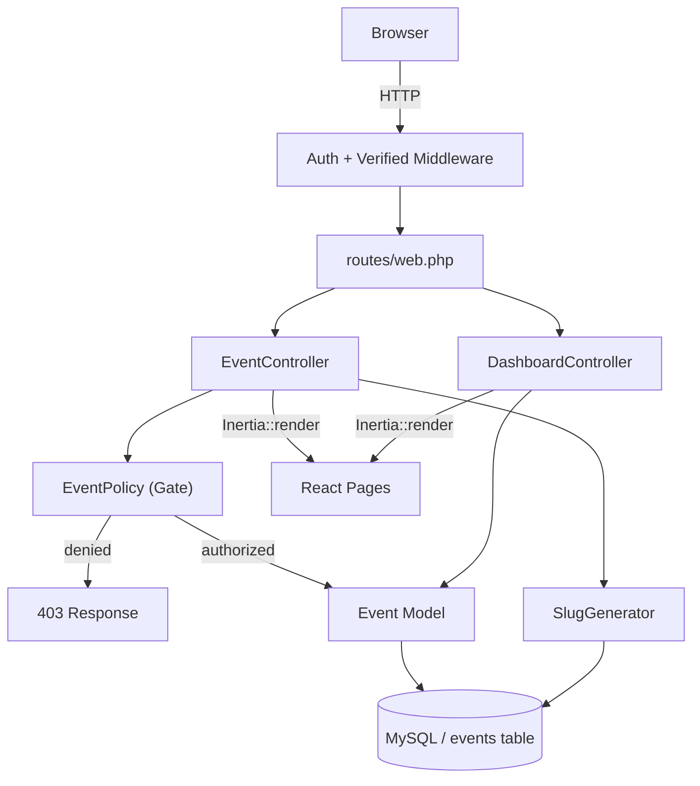
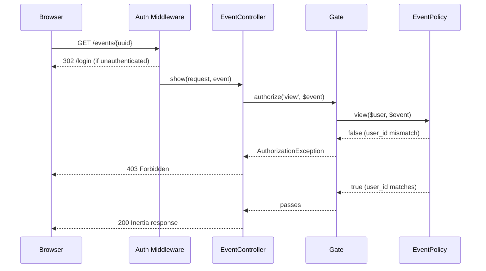

# Design Document — MomentGather Foundation

## Overview

This document describes the technical design for the MomentGather foundation phase. The feature adds organizer-facing event management on top of an existing Laravel 13 + Inertia.js + React 19 application that already provides authentication, a sidebar layout, and shadcn/ui components.

The scope covers:
- Application rebranding to "MomentGather"
- An `events` database table and `Event` Eloquent model
- Slug generation with uniqueness guarantees
- A full event CRUD controller with form request validation
- An `EventPolicy` for organizer-scoped authorization
- A `DashboardController` replacing the current inline Inertia route
- Five Inertia/React pages (Dashboard, Events/Index, Events/Show, Events/Create, Events/Edit)
- Sidebar navigation update
- Wayfinder route helpers for all new routes
- An `EventFactory` and PHPUnit feature tests

No new packages are introduced. All patterns follow the conventions established by the existing codebase.

---

## Architecture

The feature fits entirely within the existing Laravel + Inertia monolith. The architecture is unchanged: HTTP requests enter through the standard Laravel request lifecycle, pass through middleware, hit controllers, which return Inertia responses. The React frontend receives props via Inertia and renders pages inside the existing `AppLayout`.



### Key design decisions

**DashboardController instead of `Route::inertia`** — the current dashboard route uses the shorthand `Route::inertia('dashboard', 'dashboard')`. The dashboard now needs to pass event statistics as props, so it must be replaced with a real controller action. The existing Wayfinder-generated `dashboard` route helper continues to work because the route name and URL are unchanged.

**`App\Services\SlugGenerator`** — slug generation is extracted into a dedicated service class rather than placed in a model boot method or controller. This makes it independently testable and keeps the model clean.

**UUID route key** — routes use the event's `uuid` column rather than `id`, so public URLs never expose sequential integer IDs. `getRouteKeyName()` returns `'uuid'`.

**Policy authorization via `$this->authorize()`** — all EventController show/edit/update/destroy actions call `$this->authorize('action', $event)` before any business logic, following the same pattern the rest of the app uses.

---

## Components and Interfaces

### Routes — `routes/web.php`

Replace the inline dashboard Inertia route and add the event resource:

```php
use App\Http\Controllers\DashboardController;
use App\Http\Controllers\EventController;
use Illuminate\Support\Facades\Route;

Route::inertia('/', 'welcome')->name('home');

Route::middleware(['auth', 'verified'])->group(function () {
    Route::get('dashboard', [DashboardController::class, 'index'])->name('dashboard');

    Route::resource('events', EventController::class)
        ->parameters(['events' => 'event'])
        ->except(['index'])
        ->names([
            'create'  => 'events.create',
            'store'   => 'events.store',
            'show'    => 'events.show',
            'edit'    => 'events.edit',
            'update'  => 'events.update',
            'destroy' => 'events.destroy',
        ]);

    Route::get('events', [EventController::class, 'index'])->name('events.index');
});

require __DIR__.'/settings.php';
```

This produces the following routes:

| Method    | URI                      | Name            | Controller action        |
|-----------|--------------------------|-----------------|--------------------------|
| GET       | `/dashboard`             | `dashboard`     | `DashboardController@index` |
| GET       | `/events`                | `events.index`  | `EventController@index`  |
| GET       | `/events/create`         | `events.create` | `EventController@create` |
| POST      | `/events`                | `events.store`  | `EventController@store`  |
| GET       | `/events/{event}`        | `events.show`   | `EventController@show`   |
| GET       | `/events/{event}/edit`   | `events.edit`   | `EventController@edit`   |
| PUT/PATCH | `/events/{event}`        | `events.update` | `EventController@update` |
| DELETE    | `/events/{event}`        | `events.destroy`| `EventController@destroy`|

The `{event}` route parameter resolves via UUID because `Event::getRouteKeyName()` returns `'uuid'`.

---

### `App\Services\SlugGenerator`

A single-responsibility service class that derives a unique slug from an event name.

```php
namespace App\Services;

use Illuminate\Support\Str;
use App\Models\Event;

class SlugGenerator
{
    public function generate(string $name, ?int $excludeId = null): string
    {
        $base = $this->slugify($name);

        if ($base === '') {
            // fallback: will be replaced by caller with UUID-derived slug
            return '';
        }

        return $this->makeUnique($base, $excludeId);
    }

    public function generateFromUuid(string $uuid): string
    {
        return $this->makeUnique(substr(str_replace('-', '', $uuid), 0, 12), null);
    }

    private function slugify(string $name): string
    {
        // Lowercase everything
        $slug = mb_strtolower($name);
        // Replace any sequence of non-alphanumeric characters with a single hyphen
        $slug = preg_replace('/[^a-z0-9]+/', '-', $slug);
        // Remove leading and trailing hyphens
        return trim($slug, '-');
    }

    private function makeUnique(string $base, ?int $excludeId): string
    {
        $slug = $base;
        $suffix = 2;

        while (true) {
            $query = Event::withoutTrashed()->where('slug', $slug);
            if ($excludeId !== null) {
                $query->where('id', '!=', $excludeId);
            }
            if (! $query->exists()) {
                return $slug;
            }
            $slug = $base . '-' . $suffix;
            $suffix++;
        }
    }
}
```

**Algorithm:**
1. Lowercase the name.
2. Replace sequences of non-alphanumeric characters with `-`.
3. Trim leading/trailing hyphens.
4. If the result is empty (name had no alphanumeric characters), fall back to a slug derived from the first 12 hex characters of the event's UUID.
5. Query non-deleted events for a slug collision. If none, return the base. Otherwise append `-2`, `-3`, etc., until unique.

The `excludeId` parameter is not used during create (pass `null`), but allows future use if slug re-generation is ever needed. Since requirement 5.3 mandates that updates never change the slug, this parameter is unused in the update path.

**Registration** — `SlugGenerator` is resolved via the service container. It can be injected into `EventController` via constructor injection or resolved with `app(SlugGenerator::class)`.

---

### `App\Models\Event`

Follows the same PHP 8 attribute style as `User.php`:

```php
namespace App\Models;

use App\Models\User;
use Database\Factories\EventFactory;
use Illuminate\Database\Eloquent\Attributes\Fillable;
use Illuminate\Database\Eloquent\Factories\HasFactory;
use Illuminate\Database\Eloquent\Model;
use Illuminate\Database\Eloquent\Relations\BelongsTo;
use Illuminate\Database\Eloquent\SoftDeletes;
use Illuminate\Support\Str;

#[Fillable(['uuid', 'name', 'slug', 'description', 'event_date', 'location', 'status', 'upload_enabled'])]
class Event extends Model
{
    /** @use HasFactory<EventFactory> */
    use HasFactory, SoftDeletes;

    protected function casts(): array
    {
        return [
            'event_date'   => 'date',
            'upload_enabled' => 'boolean',
            'deleted_at'   => 'datetime',
        ];
    }

    protected static function booted(): void
    {
        static::creating(function (Event $event): void {
            if (empty($event->uuid)) {
                $event->uuid = (string) Str::uuid();
            }
        });
    }

    public function getRouteKeyName(): string
    {
        return 'uuid';
    }

    public function user(): BelongsTo
    {
        return $this->belongsTo(User::class);
    }
}
```

**`User` model addition** — add a `hasMany` relationship:

```php
use App\Models\Event;
use Illuminate\Database\Eloquent\Relations\HasMany;

public function events(): HasMany
{
    return $this->hasMany(Event::class);
}
```

**Status values** — enforced at the validation layer (`StoreEventRequest` / `UpdateEventRequest`) using `Rule::in(['active', 'archived'])`. The model does not use a PHP enum; keeping it as a plain string column with application-layer validation maintains compatibility with the existing codebase style.

---

### `App\Http\Requests\StoreEventRequest`

```php
namespace App\Http\Requests;

use Illuminate\Foundation\Http\FormRequest;
use Illuminate\Validation\Rule;

class StoreEventRequest extends FormRequest
{
    public function authorize(): bool
    {
        return true; // auth middleware handles authentication; policy handles ownership
    }

    public function rules(): array
    {
        return [
            'name'        => ['required', 'string', 'max:255'],
            'description' => ['nullable', 'string', 'max:5000'],
            'event_date'  => ['nullable', 'date'],
            'location'    => ['nullable', 'string', 'max:255'],
        ];
    }
}
```

`status` and `upload_enabled` are **not** included in `StoreEventRequest` because they are set to their defaults (`active`, `true`) by the controller on creation, not submitted by the user.

---

### `App\Http\Requests\UpdateEventRequest`

```php
namespace App\Http\Requests;

use Illuminate\Foundation\Http\FormRequest;
use Illuminate\Validation\Rule;

class UpdateEventRequest extends FormRequest
{
    public function authorize(): bool
    {
        return true;
    }

    public function rules(): array
    {
        return [
            'name'        => ['required', 'string', 'max:255'],
            'description' => ['nullable', 'string', 'max:5000'],
            'event_date'  => ['nullable', 'date'],
            'location'    => ['nullable', 'string', 'max:255'],
            'status'      => ['required', Rule::in(['active', 'archived'])],
        ];
    }
}
```

`status` is included in the update request because organizers can archive/reactivate events after creation.

---

### `App\Policies\EventPolicy`

```php
namespace App\Policies;

use App\Models\Event;
use App\Models\User;

class EventPolicy
{
    public function view(User $user, Event $event): bool
    {
        return $user->id === $event->user_id;
    }

    public function update(User $user, Event $event): bool
    {
        return $user->id === $event->user_id;
    }

    public function delete(User $user, Event $event): bool
    {
        return $user->id === $event->user_id;
    }
}
```

Policy discovery is automatic in Laravel 13 (model `Event` → `EventPolicy`) so no explicit registration is needed. The policy does not define a `create` method because event creation is scoped to the authenticated user at the controller level, not via a policy gate.

---

### `App\Http\Controllers\DashboardController`

```php
namespace App\Http\Controllers;

use App\Models\Event;
use Illuminate\Http\Request;
use Inertia\Inertia;
use Inertia\Response;

class DashboardController extends Controller
{
    public function index(Request $request): Response
    {
        $user = $request->user();

        $stats = [
            'totalEvents'    => Event::where('user_id', $user->id)->count(),
            'activeEvents'   => Event::where('user_id', $user->id)->where('status', 'active')->count(),
            'archivedEvents' => Event::where('user_id', $user->id)->where('status', 'archived')->count(),
        ];

        $recentEvents = Event::where('user_id', $user->id)
            ->orderByDesc('created_at')
            ->limit(5)
            ->get(['uuid', 'name', 'status', 'event_date', 'created_at']);

        return Inertia::render('dashboard', [
            'stats'        => $stats,
            'recentEvents' => $recentEvents,
        ]);
    }
}
```

---

### `App\Http\Controllers\EventController`

```php
namespace App\Http\Controllers;

use App\Http\Requests\StoreEventRequest;
use App\Http\Requests\UpdateEventRequest;
use App\Models\Event;
use App\Services\SlugGenerator;
use Illuminate\Http\RedirectResponse;
use Illuminate\Http\Request;
use Inertia\Inertia;
use Inertia\Response;

class EventController extends Controller
{
    public function __construct(private SlugGenerator $slugGenerator) {}

    public function index(Request $request): Response
    {
        $events = Event::where('user_id', $request->user()->id)
            ->orderByDesc('created_at')
            ->get();

        return Inertia::render('Events/Index', ['events' => $events]);
    }

    public function create(): Response
    {
        return Inertia::render('Events/Create');
    }

    public function store(StoreEventRequest $request): RedirectResponse
    {
        $data = $request->validated();

        $uuid = (string) \Illuminate\Support\Str::uuid();
        $base = $this->slugGenerator->generate($data['name']);
        if ($base === '') {
            $slug = $this->slugGenerator->generateFromUuid($uuid);
        } else {
            $slug = $base;
        }

        $event = $request->user()->events()->create([
            ...$data,
            'uuid'           => $uuid,
            'slug'           => $slug,
            'status'         => 'active',
            'upload_enabled' => true,
        ]);

        return to_route('events.show', $event);
    }

    public function show(Request $request, Event $event): Response
    {
        $this->authorize('view', $event);

        return Inertia::render('Events/Show', ['event' => $event]);
    }

    public function edit(Request $request, Event $event): Response
    {
        $this->authorize('update', $event);

        return Inertia::render('Events/Edit', ['event' => $event]);
    }

    public function update(UpdateEventRequest $request, Event $event): RedirectResponse
    {
        $this->authorize('update', $event);

        $event->update($request->validated());

        return to_route('events.show', $event);
    }

    public function destroy(Request $request, Event $event): RedirectResponse
    {
        $this->authorize('delete', $event);

        $event->delete();

        return to_route('events.index');
    }
}
```

**Note on `store`** — the UUID is generated in the controller rather than relying solely on the model's `booted()` hook. This is necessary because the slug generator's UUID-fallback path needs the UUID value before `create()` is called. The model boot will skip overwriting `uuid` if it is already set (see `empty($event->uuid)` guard in the model).

**Transaction wrapping for store** — to satisfy Requirement 6.9 (no partial records on failure), wrap the `store` body in `DB::transaction()`:

```php
use Illuminate\Support\Facades\DB;

public function store(StoreEventRequest $request): RedirectResponse
{
    return DB::transaction(function () use ($request): RedirectResponse {
        // ... same body as above
    });
}
```

---

## Data Models

### `events` Table Migration

```php
return new class extends Migration
{
    public function up(): void
    {
        Schema::create('events', function (Blueprint $table) {
            $table->id();
            $table->foreignId('user_id')->constrained()->cascadeOnDelete()->index();
            $table->char('uuid', 36)->unique();
            $table->string('name', 255);
            $table->string('slug', 255)->unique();
            $table->text('description')->nullable();
            $table->date('event_date')->nullable();
            $table->string('location', 255)->nullable();
            $table->string('status', 20)->default('active');
            $table->boolean('upload_enabled')->default(true);
            $table->timestamps();
            $table->softDeletes();
        });
    }

    public function down(): void
    {
        Schema::dropIfExists('events');
    }
};
```

**Schema notes:**
- `foreignId('user_id')` automatically creates `UNSIGNED BIGINT` and the foreign key; `.index()` adds the non-unique index required by Requirement 3.2.
- `char(36)` for UUID is intentional — UUID v4 is always exactly 36 characters.
- The `slug` column has a unique constraint at the database level, providing a final safety net beyond the application-level uniqueness check in `SlugGenerator`.
- `softDeletes()` adds the nullable `deleted_at` column.
- The `status` column uses `string(20)` rather than an enum to avoid migration complexity when adding future statuses.

### TypeScript Data Interfaces

These interfaces represent the shape of data passed from controllers to Inertia pages:

```typescript
// resources/js/types/models.ts (new file, re-exported from types/index.ts)

export type EventStatus = 'active' | 'archived';

export interface Event {
    id: number;
    uuid: string;
    user_id: number;
    name: string;
    slug: string;
    description: string | null;
    event_date: string | null;   // ISO date string e.g. "2025-12-31"
    location: string | null;
    status: EventStatus;
    upload_enabled: boolean;
    created_at: string;          // ISO datetime string
    updated_at: string;
    deleted_at: string | null;
}

export interface DashboardStats {
    totalEvents: number;
    activeEvents: number;
    archivedEvents: number;
}
```

---

## Frontend Components

### Wayfinder Route Helpers

After registering the new routes, run `php artisan wayfinder:generate` to regenerate `resources/js/routes/index.ts`. The generated file will expose these additional helpers:

| Helper function                       | URL                       | Method |
|---------------------------------------|---------------------------|--------|
| `eventsIndex()`                       | `/events`                 | GET    |
| `eventsCreate()`                      | `/events/create`          | GET    |
| `eventsStore()`                       | `/events`                 | POST   |
| `eventsShow({ event: uuid })`         | `/events/{event}`         | GET    |
| `eventsEdit({ event: uuid })`         | `/events/{event}/edit`    | GET    |
| `eventsUpdate({ event: uuid })`       | `/events/{event}`         | PUT    |
| `eventsDestroy({ event: uuid })`      | `/events/{event}`         | DELETE |

> The exact exported names follow Wayfinder's naming convention derived from the route names (`events.index` → `eventsIndex`, etc.). Pages must import from `@/routes` exclusively — no hardcoded URL strings.

---

### `app-sidebar.tsx` — Events Nav Item

Add the `CalendarDays` icon and Events nav item to `mainNavItems`. Active state uses `isCurrentOrParentUrl` so the item highlights on any `/events/*` URL:

```tsx
import { CalendarDays, LayoutGrid } from 'lucide-react';
import { eventsIndex } from '@/routes';

const mainNavItems: NavItem[] = [
    {
        title: 'Dashboard',
        href: dashboard(),
        icon: LayoutGrid,
    },
    {
        title: 'Events',
        href: eventsIndex(),
        icon: CalendarDays,
    },
];
```

`NavMain` uses `isCurrentUrl` by default. The `NavItem` type has an optional `isActive` field that takes precedence when set. Since `NavMain` already supports `isCurrentOrParentUrl` via the hook, the `Events` item needs its active-state detection changed from exact match to prefix match. The cleanest way is to pass `isActive` computed from the current URL:

```tsx
// In AppSidebar, compute isActive for the Events item:
import { useCurrentUrl } from '@/hooks/use-current-url';

export function AppSidebar() {
    const { isCurrentOrParentUrl } = useCurrentUrl();

    const mainNavItems: NavItem[] = [
        { title: 'Dashboard', href: dashboard(), icon: LayoutGrid },
        {
            title: 'Events',
            href: eventsIndex(),
            icon: CalendarDays,
            isActive: isCurrentOrParentUrl(eventsIndex()),
        },
    ];
    // ...
}
```

`NavMain` already passes `isActive` to `SidebarMenuButton` when present on the item. Moving `mainNavItems` inside the component function body is necessary to use the hook.

---

### `pages/dashboard.tsx`

```tsx
import { Head, Link } from '@inertiajs/react';
import { Card, CardContent, CardHeader, CardTitle } from '@/components/ui/card';
import { Badge } from '@/components/ui/badge';
import { eventsCreate } from '@/routes';
import { dashboard } from '@/routes';
import type { DashboardStats, Event } from '@/types/models';

interface Props {
    stats: DashboardStats;
    recentEvents: Pick<Event, 'uuid' | 'name' | 'status' | 'event_date' | 'created_at'>[];
}

export default function Dashboard({ stats, recentEvents }: Props) {
    return (
        <>
            <Head title="Dashboard" />
            <div className="flex flex-col gap-6 p-4">
                {/* Stat cards */}
                <div className="grid gap-4 md:grid-cols-3">
                    <Card>
                        <CardHeader><CardTitle>Total Events</CardTitle></CardHeader>
                        <CardContent><p className="text-3xl font-bold">{stats.totalEvents}</p></CardContent>
                    </Card>
                    <Card>
                        <CardHeader><CardTitle>Active Events</CardTitle></CardHeader>
                        <CardContent><p className="text-3xl font-bold">{stats.activeEvents}</p></CardContent>
                    </Card>
                    <Card>
                        <CardHeader><CardTitle>Archived Events</CardTitle></CardHeader>
                        <CardContent><p className="text-3xl font-bold">{stats.archivedEvents}</p></CardContent>
                    </Card>
                </div>

                {/* Recent events */}
                <Card>
                    <CardHeader>
                        <CardTitle>Recent Events</CardTitle>
                    </CardHeader>
                    <CardContent>
                        {recentEvents.length === 0 ? (
                            <p className="text-muted-foreground">
                                You have no events yet.{' '}
                                <Link href={eventsCreate()} className="underline">
                                    Create your first event.
                                </Link>
                            </p>
                        ) : (
                            <ul className="divide-y">
                                {recentEvents.map((event) => (
                                    <li key={event.uuid} className="flex items-center justify-between py-3">
                                        <span className="font-medium">{event.name}</span>
                                        <div className="flex items-center gap-3">
                                            <Badge variant={event.status === 'active' ? 'default' : 'secondary'}>
                                                {event.status}
                                            </Badge>
                                            <span className="text-muted-foreground text-sm">
                                                {event.event_date
                                                    ? new Date(event.event_date).toLocaleDateString()
                                                    : 'No date set'}
                                            </span>
                                        </div>
                                    </li>
                                ))}
                            </ul>
                        )}
                    </CardContent>
                </Card>

                <div>
                    <Link href={eventsCreate()} className="...">
                        Create Event
                    </Link>
                </div>
            </div>
        </>
    );
}

Dashboard.layout = {
    breadcrumbs: [{ title: 'Dashboard', href: dashboard() }],
};
```

---

### `pages/Events/Index.tsx`

```tsx
interface Props {
    events: Event[];
}

export default function EventsIndex({ events }: Props) {
    // ...
}

EventsIndex.layout = {
    breadcrumbs: [
        { title: 'Dashboard', href: dashboard() },
        { title: 'Events', href: eventsIndex() },
    ],
};
```

**Columns displayed per event:** name, event date (or "No date set"), location (or "No location"), status badge, upload enabled indicator, created date, action links (View → `eventsShow`, Edit → `eventsEdit`, Delete → dialog confirmation → `router.delete(eventsDestroy)`).

The delete confirmation uses a `Dialog` component from shadcn/ui rather than `window.confirm`, keeping the UI consistent.

---

### `pages/Events/Create.tsx`

```tsx
import { useForm } from '@inertiajs/react';
import InputError from '@/components/input-error';
import { eventsStore, eventsIndex, dashboard } from '@/routes';

export default function EventsCreate() {
    const { data, setData, post, processing, errors } = useForm({
        name: '',
        description: '',
        event_date: '',
        location: '',
    });

    function submit(e: React.FormEvent) {
        e.preventDefault();
        post(eventsStore());
    }

    return (
        // Form with Name, Description, Event Date, Location fields
        // Each field followed by <InputError message={errors.fieldName} />
    );
}

EventsCreate.layout = {
    breadcrumbs: [
        { title: 'Dashboard', href: dashboard() },
        { title: 'Events', href: eventsIndex() },
        { title: 'Create Event', href: eventsCreate() },
    ],
};
```

---

### `pages/Events/Edit.tsx`

```tsx
interface Props {
    event: Event;
}

export default function EventsEdit({ event }: Props) {
    const { data, setData, put, processing, errors } = useForm({
        name: event.name,
        description: event.description ?? '',
        event_date: event.event_date ?? '',
        location: event.location ?? '',
        status: event.status,
    });

    function submit(e: React.FormEvent) {
        e.preventDefault();
        put(eventsUpdate({ event: event.uuid }));
    }

    // Form fields: Name, Description, Event Date, Location, Status (Select with 'active'/'archived')
}

EventsEdit.layout = (page: React.ReactNode, props: Props) => ({
    breadcrumbs: [
        { title: 'Dashboard', href: dashboard() },
        { title: 'Events', href: eventsIndex() },
        { title: props.event.name, href: eventsShow({ event: props.event.uuid }) },
        { title: 'Edit', href: eventsEdit({ event: props.event.uuid }) },
    ],
});
```

Note: the breadcrumb uses the event name dynamically. Inertia allows the `layout` property to be a function receiving the page component and props.

---

### `pages/Events/Show.tsx`

```tsx
interface Props {
    event: Event;
}

export default function EventsShow({ event }: Props) {
    return (
        <>
            <Head title={event.name} />
            {/* Detail fields: name, description|"No description", event_date|"No date set",
                location|"No location", status badge, upload_enabled indicator, created_at */}

            {/* Action buttons */}
            <Link href={eventsEdit({ event: event.uuid })}>Edit</Link>
            {/* Delete button → Dialog confirmation → router.delete(eventsDestroy) */}

            {/* Coming Soon sections */}
            <section><h2>QR Code</h2><span>Coming Soon</span></section>
            <section><h2>Photo Gallery</h2><span>Coming Soon</span></section>
            <section><h2>Uploads</h2><span>Coming Soon</span></section>
        </>
    );
}

EventsShow.layout = (page: React.ReactNode, props: Props) => ({
    breadcrumbs: [
        { title: 'Dashboard', href: dashboard() },
        { title: 'Events', href: eventsIndex() },
        { title: props.event.name, href: eventsShow({ event: props.event.uuid }) },
    ],
});
```

---

## Application Branding

`config/app.php` currently has `'name' => env('APP_NAME', 'Laravel')`. Change the default to `'MomentGather'`:

```php
'name' => env('APP_NAME', 'MomentGather'),
```

The `HandleInertiaRequests` middleware already shares `config('app.name')` as `name` to every page, and `AppLogo` reads it via `usePage().props.name`. The browser tab title uses `<Head title="..." />` which appends the app name via Inertia's `<title>` handling.

The welcome page (`welcome.tsx`) currently hard-codes Laravel branding elements. The `<h1>` heading should be replaced to display the app name from shared props:

```tsx
const { name } = usePage().props;
// ...
<h1 className="...">{name}</h1>
```

---

## Authorization Flow



- `auth` middleware runs first and redirects unauthenticated requests to `/login`.
- `verified` middleware ensures email verification (already present in the existing group).
- `$this->authorize('view', $event)` in each controller action triggers policy evaluation.
- A mismatch returns a 403 before any data is read or modified.

---

## Correctness Properties

*A property is a characteristic or behavior that should hold true across all valid executions of a system — essentially, a formal statement about what the system should do. Properties serve as the bridge between human-readable specifications and machine-verifiable correctness guarantees.*

### Property 1: Slug format invariant

*For any* valid event name (containing at least one alphanumeric character), the slug generated by `SlugGenerator::generate()` SHALL match the regular expression `^[a-z0-9]+(-[a-z0-9]+)*$`.

**Validates: Requirements 5.1, 5.5, 17.4**

### Property 2: Slug uniqueness across concurrent creations

*For any* number of events created with the same base name, all resulting slug values SHALL be distinct, and each slug SHALL start with the base slug of the first event.

**Validates: Requirements 5.2, 17.2**

### Property 3: Slug immutability on update

*For any* existing event and any valid new name submitted in an update request, the event's `slug` value after the update SHALL be identical to its value before the update.

**Validates: Requirements 5.3**

### Property 4: Immutable identity fields on update

*For any* existing event and any valid update payload, the values of `id`, `uuid`, `user_id`, and `slug` SHALL be identical before and after the update is applied.

*(This subsumes Property 3, which is retained for direct traceability to Requirement 5.3.)*

**Validates: Requirements 7.2**

### Property 5: Event ownership association on creation

*For any* valid event creation payload submitted by an authenticated organizer, the stored event's `user_id` SHALL equal the authenticated organizer's `id`.

**Validates: Requirements 6.1**

### Property 6: Policy correctness — view, update, delete

*For any* event `E` and any organizer `O`, the `EventPolicy` `view`, `update`, and `delete` methods SHALL return `true` if and only if `O.id === E.user_id`.

**Validates: Requirements 9.2, 9.3, 9.4**

### Property 7: Soft-delete preserves record

*For any* event owned by an organizer, after a successful delete request, the event record SHALL exist in the database with a non-null `deleted_at`, and the record's other fields SHALL be unchanged.

**Validates: Requirements 8.1**

### Property 8: Soft-deleted events excluded from listings

*For any* soft-deleted event, it SHALL NOT appear in the response of `EventController::index`, `EventController::show`, or `DashboardController::index` for any organizer.

**Validates: Requirements 8.2**

### Property 9: Dashboard statistics accuracy

*For any* set of events owned by an organizer (a mix of active, archived, and soft-deleted), the dashboard stats SHALL satisfy:
- `totalEvents` = count of non-deleted events
- `activeEvents` = count of non-deleted events with `status = 'active'`
- `archivedEvents` = count of non-deleted events with `status = 'archived'`
- `recentEvents` = the up-to-5 non-deleted events with the largest `created_at` values, in descending order

**Validates: Requirements 10.1**

### Property 10: Event index ordering

*For any* set of non-deleted events owned by an organizer, the `EventController::index` response SHALL return them in descending `created_at` order.

**Validates: Requirements 11.1**

### Property 11: APP_NAME propagation

*For any* non-empty string `S` set as `APP_NAME`, the shared Inertia `name` prop received by every page SHALL equal `S`.

**Validates: Requirements 1.3**

### Property 12: Events nav item active state

*For any* URL whose path begins with `/events`, `isCurrentOrParentUrl('/events')` SHALL return `true`, and for any URL whose path does not begin with `/events`, it SHALL return `false`.

**Validates: Requirements 15.2, 15.3**

## Error Handling

| Scenario | Handling |
|----------|----------|
| Unauthenticated request to any organizer route | `auth` middleware redirects to `/login` (HTTP 302) |
| Authenticated user accessing another user's event | `EventPolicy` returns false → `AuthorizationException` → HTTP 403 |
| Route parameter UUID not found | Laravel model binding returns HTTP 404 |
| Validation failure on create/edit form | `FormRequest` returns HTTP 422 with validation error bag; Inertia preserves form state and displays inline errors via `InputError` |
| Storage failure during `store` | `DB::transaction()` rolls back; exception propagates to Laravel's exception handler, returning HTTP 500 |
| Storage failure during `destroy` | Uncaught exception; event record is unchanged (no `deleted_at` set) |
| Flash messages | Success redirects (create, update, delete) optionally use `Inertia::flash('toast', ...)` for toast notifications consistent with the `ProfileController` pattern |

---

## Testing Strategy

### PHPUnit Feature Tests (`tests/Feature/`)

The tests map directly to Requirement 17.3. Organize them in `tests/Feature/EventTest.php` and `tests/Feature/DashboardTest.php`.

**Authentication guard tests (Req 17.3.a, 17.3.b):**

```php
#[Test]
public function guest_cannot_access_dashboard(): void
{
    $this->get('/dashboard')->assertRedirect('/login');
}

#[Test]
#[DataProvider('guestBlockedRoutes')]
public function guest_cannot_access_event_routes(string $method, string $url): void
{
    $this->$method($url)->assertRedirect('/login');
}

public static function guestBlockedRoutes(): array
{
    $uuid = Str::uuid();
    return [
        ['get', '/events'],
        ['get', '/events/create'],
        ['get', "/events/{$uuid}"],
        ['get', "/events/{$uuid}/edit"],
    ];
}
```

**Create event tests (Req 17.3.c, 17.3.d):**

```php
#[Test]
public function authenticated_user_can_create_event(): void
{
    $user = User::factory()->create();
    $response = $this->actingAs($user)
        ->post('/events', ['name' => 'My Event']);

    $response->assertRedirect();
    $this->assertDatabaseHas('events', ['name' => 'My Event', 'user_id' => $user->id]);
}
```

**User owns multiple events (Req 17.3.e):**

```php
#[Test]
public function user_can_own_multiple_events(): void
{
    $user = User::factory()->create();
    Event::factory()->count(3)->for($user)->create();

    $this->assertSame(3, $user->events()->count());
}
```

**Update event (Req 17.3.f):**

```php
#[Test]
public function authenticated_user_can_update_own_event(): void
{
    $user = User::factory()->create();
    $event = Event::factory()->for($user)->create();

    $this->actingAs($user)
        ->put("/events/{$event->uuid}", ['name' => 'Updated', 'status' => 'active'])
        ->assertRedirect();

    $this->assertSame('Updated', $event->fresh()->name);
}
```

**Soft delete (Req 17.3.g):**

```php
#[Test]
public function delete_soft_deletes_event_and_redirects_to_index(): void
{
    $user = User::factory()->create();
    $event = Event::factory()->for($user)->create();

    $this->actingAs($user)
        ->delete("/events/{$event->uuid}")
        ->assertRedirect('/events');

    $this->assertSoftDeleted('events', ['id' => $event->id]);
}
```

**Cross-organizer 403 (Req 17.3.h):**

```php
#[Test]
public function user_cannot_update_another_users_event(): void
{
    $owner = User::factory()->create();
    $other = User::factory()->create();
    $event = Event::factory()->for($owner)->create();

    $this->actingAs($other)
        ->put("/events/{$event->uuid}", ['name' => 'Hijack', 'status' => 'active'])
        ->assertForbidden();
}

#[Test]
public function user_cannot_delete_another_users_event(): void
{
    $owner = User::factory()->create();
    $other = User::factory()->create();
    $event = Event::factory()->for($owner)->create();

    $this->actingAs($other)
        ->delete("/events/{$event->uuid}")
        ->assertForbidden();
}
```

**Slug format property test (Req 17.4):**

```php
#[Test]
public function factory_generated_slugs_match_format(): void
{
    $user = User::factory()->create();
    $events = Event::factory()->count(10)->for($user)->create();

    foreach ($events as $event) {
        $this->assertMatchesRegularExpression(
            '/^[a-z0-9]+(-[a-z0-9]+)*$/',
            $event->slug,
            "Slug '{$event->slug}' for event '{$event->name}' does not match expected format"
        );
    }
}
```

### Property-Based Tests

Use **[Eris](https://github.com/giorgiosironi/eris)** (PHP property-based testing library) or equivalent for PHP. The key property tests align directly with the Correctness Properties above.

**Test: Slug format invariant:**

```php
// Tag: Feature: moment-gather-foundation, Property 1: Slug format invariant
public function test_slug_format_invariant(): void
{
    $generator = app(SlugGenerator::class);

    // Generate 100+ random names with alphanumeric content and assert slug format
    for ($i = 0; $i < 100; $i++) {
        $name = $this->randomNameWithAlphanumeric();
        $slug = $generator->generate($name);
        $this->assertMatchesRegularExpression('/^[a-z0-9]+(-[a-z0-9]+)*$/', $slug);
    }
}
```

**Test: Immutable identity fields on update:**

```php
// Tag: Feature: moment-gather-foundation, Property 4: Immutable identity fields on update
public function test_update_preserves_identity_fields(): void
{
    $user = User::factory()->create();

    for ($i = 0; $i < 50; $i++) {
        $event = Event::factory()->for($user)->create();
        $before = $event->only(['id', 'uuid', 'user_id', 'slug']);

        $this->actingAs($user)->put("/events/{$event->uuid}", [
            'name'   => fake()->sentence(),
            'status' => fake()->randomElement(['active', 'archived']),
        ]);

        $after = $event->fresh()->only(['id', 'uuid', 'user_id', 'slug']);
        $this->assertSame($before, $after);
    }
}
```

**Test: Dashboard statistics accuracy:**

```php
// Tag: Feature: moment-gather-foundation, Property 9: Dashboard statistics accuracy
public function test_dashboard_stats_are_accurate(): void
{
    $user = User::factory()->create();

    for ($i = 0; $i < 20; $i++) {
        $activeCount   = random_int(0, 5);
        $archivedCount = random_int(0, 5);
        $deletedCount  = random_int(0, 3);

        Event::factory()->count($activeCount)->for($user)->create(['status' => 'active']);
        Event::factory()->count($archivedCount)->for($user)->create(['status' => 'archived']);
        Event::factory()->count($deletedCount)->for($user)->create()->each->delete();

        $response = $this->actingAs($user)->get('/dashboard');
        $response->assertInertia(fn ($page) => $page
            ->where('stats.totalEvents', $activeCount + $archivedCount)
            ->where('stats.activeEvents', $activeCount)
            ->where('stats.archivedEvents', $archivedCount)
        );

        // Clean up for next iteration
        Event::withTrashed()->where('user_id', $user->id)->forceDelete();
    }
}
```

### `EventFactory` Design

```php
// database/factories/EventFactory.php
namespace Database\Factories;

use App\Models\Event;
use App\Models\User;
use App\Services\SlugGenerator;
use Illuminate\Database\Eloquent\Factories\Factory;
use Illuminate\Support\Str;

class EventFactory extends Factory
{
    protected $model = Event::class;

    public function definition(): array
    {
        $name = $this->faker->sentence(3);
        $uuid = (string) Str::uuid();

        $generator = app(SlugGenerator::class);
        $base = $generator->generate($name);
        $slug = $base !== '' ? $base : $generator->generateFromUuid($uuid);

        return [
            'user_id'        => User::factory(),
            'uuid'           => $uuid,
            'name'           => $name,
            'slug'           => $slug,
            'description'    => $this->faker->optional()->paragraph(),
            'event_date'     => $this->faker->optional()->dateTimeBetween('now', '+2 years')?->format('Y-m-d'),
            'location'       => $this->faker->optional()->city(),
            'status'         => $this->faker->randomElement(['active', 'archived']),
            'upload_enabled' => $this->faker->boolean(),
        ];
    }
}
```

**Uniqueness guarantee** — the factory calls `SlugGenerator::generate()` which queries the database for collisions, so concurrent factory calls (e.g., `Event::factory()->count(10)->create()`) will produce unique slugs automatically via the `-2`, `-3` suffix logic.
