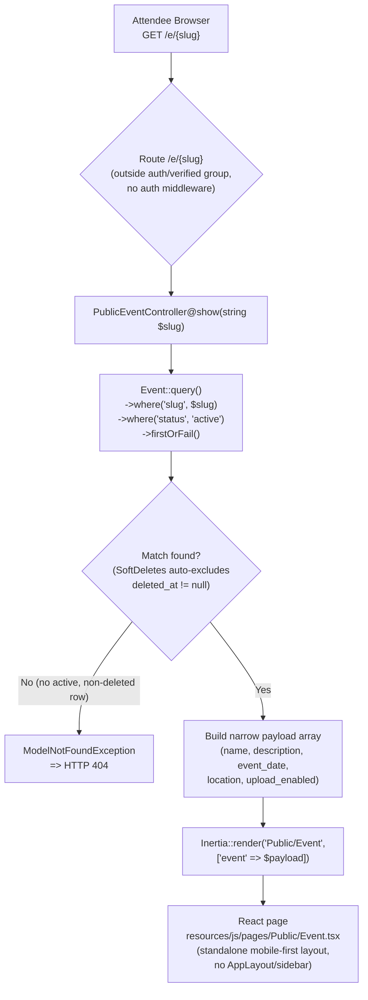

# Design Document

## Overview

The **public event page** is an attendee-facing page served at `/e/{slug}` that requires no authentication. It renders a clean, mobile-first summary of a single event (name, optional description, optional friendly-formatted date, optional location, and an upload-availability call to action) so that attendees who follow a shared link — later a QR code — can immediately understand the event and reach the primary action.

Key design decisions, all grounded in the existing Phase 2 foundation:

- **Slug-based lookup, not uuid.** The `Event` model's `getRouteKeyName()` returns `'uuid'`, which is what organizer routes bind on. The public route locates events by the `events.slug` column instead, resolved explicitly in the controller. This avoids fighting the model's route-key convention.
- **Visibility = active-only.** An event is publicly viewable only when `status = 'active'` and it is not soft-deleted. Every other case — `archived`, soft-deleted, nonexistent slug, or any hypothetical non-active status — resolves to a standard HTTP 404. This single server-side rule expresses the "draft/archived/deleted are never public" requirement without adding a `draft` status to the database.
- **No schema changes.** No migrations, no new columns, no changes to the `Event` model's fillable or casts. The cover region is a static placeholder because no cover-image column exists and none is introduced.
- **Privacy by construction.** The controller builds a narrow payload array containing only attendee-relevant fields. Organizer-private data (organizer email, `user_id`, database `id`, `uuid`, `slug`) is never passed to the frontend.
- **Isolation from organizer code.** A new dedicated `PublicEventController` owns all public logic. The organizer `EventController` and its routes are untouched.

Out of scope (deferred to later phases): photo uploads, a photos table, galleries, QR generation, image storage/processing. The Upload and View Gallery buttons are non-functional placeholders.

## Architecture

The public request path bypasses the organizer authentication middleware group entirely. It is a single GET route → dedicated controller → visibility-scoped query → Inertia render of a standalone React page.



Notes:

- The route is registered **outside** the `Route::middleware(['auth', 'verified'])->group(...)` block, so no authentication or email-verification check runs. Guests reach it directly.
- `firstOrFail()` raises `ModelNotFoundException`, which Laravel renders as a 404. This covers nonexistent slugs, non-active statuses, and — via the `SoftDeletes` global scope — soft-deleted rows, in a single query.
- Query parameters never enter the query. Visibility depends only on the slug path segment plus the `status`/`deleted_at` columns.

## Backend Components

### Route registration

Added near the top of `routes/web.php`, **outside** the `auth`/`verified` group, after the `home` route. It uses a plain `{slug}` string parameter (not `{event}`) precisely so that the model's uuid route-key binding does not apply — the controller resolves the slug itself.

```php
<?php

use App\Http\Controllers\DashboardController;
use App\Http\Controllers\EventController;
use App\Http\Controllers\PublicEventController;
use Illuminate\Support\Facades\Route;

Route::inertia('/', 'welcome')->name('home');

// Public attendee-facing event page. No authentication.
Route::get('/e/{slug}', [PublicEventController::class, 'show'])
    ->name('public.events.show');

Route::middleware(['auth', 'verified'])->group(function () {
    // ... existing organizer routes unchanged ...
});

require __DIR__.'/settings.php';
```

- **Name:** `public.events.show`.
- **Path:** `/e/{slug}` using GET.
- Placement outside the middleware group satisfies Requirement 1.5 and 1.2.

### PublicEventController

A new controller at `app/Http/Controllers/PublicEventController.php` with a single `show(string $slug)` method. It resolves the slug scoped to the visibility rule, then constructs the narrow payload explicitly (no `$event->toArray()`, no model serialization) so that organizer-private fields cannot leak.

```php
<?php

namespace App\Http\Controllers;

use App\Models\Event;
use Inertia\Inertia;
use Inertia\Response;

class PublicEventController extends Controller
{
    /**
     * Display the public attendee-facing page for an active event.
     *
     * Resolves the event by its slug, scoped to the visibility rule:
     * status = 'active' AND not soft-deleted. Any other case yields a 404.
     */
    public function show(string $slug): Response
    {
        // firstOrFail() throws ModelNotFoundException => HTTP 404 when no
        // matching row exists. The SoftDeletes global scope automatically
        // excludes rows where deleted_at is not null, so soft-deleted events
        // 404 without an explicit clause. Query parameters are never consulted.
        $event = Event::query()
            ->where('slug', $slug)
            ->where('status', 'active')
            ->firstOrFail();

        // Narrow, attendee-only payload. Organizer-private fields
        // (id, uuid, user_id, slug, timestamps, user relationship) are
        // intentionally excluded and never sent to the frontend.
        $payload = [
            'name'           => $event->name,
            'description'    => $event->description,
            'event_date'     => $event->event_date?->toDateString(), // ISO 'Y-m-d' or null
            'location'       => $event->location,
            'upload_enabled' => $event->upload_enabled,
        ];

        return Inertia::render('Public/Event', [
            'event' => $payload,
        ]);
    }
}
```

Behavior explained:

- **`firstOrFail()` → 404.** When no row matches `slug` + `status='active'`, `firstOrFail()` throws `ModelNotFoundException`, which Laravel's exception handler converts to a 404 response. This covers nonexistent slugs (Req 1.4) and non-active statuses (Req 2.2).
- **SoftDeletes auto-exclusion.** Because `Event` uses `SoftDeletes`, the default query builder appends `where deleted_at is null`. A soft-deleted event therefore has no matching row and 404s for free (Req 2.3), with no explicit `deleted_at` clause needed.
- **Query params ignored.** The query is built purely from the `$slug` path segment and constant `status` literal. No `request()->query(...)` value participates in visibility (Req 2.5, 10.3).
- **Explicit payload.** The payload array is hand-built from individual columns, guaranteeing organizer-private data is excluded at the source (Req 3.4, 7.4, 10.2). `event_date?->toDateString()` yields a plain ISO date string (or `null`), which the frontend formats for display.

### Untouched organizer code

`EventController` and every organizer route (`events.index`, `events.create`, `events.store`, `events.show`, `events.edit`, `events.update`, `events.destroy`) remain exactly as they are. The organizer `EventController@show` still binds by uuid and renders `Events/Show`. The public feature adds only the new route line and the new controller class (Req 3.1).

## Data Flow / Payload Shape

The controller sends exactly one prop, `event`, whose shape is the narrow payload below. No other event fields cross the boundary.

Payload array keys (PHP side):

| Key              | Source                              | Type (JSON)        | Notes                                       |
|------------------|-------------------------------------|--------------------|---------------------------------------------|
| `name`           | `$event->name`                      | `string`           | Always present.                             |
| `description`    | `$event->description`               | `string \| null`   | `null` when the organizer set none.         |
| `event_date`     | `$event->event_date?->toDateString()` | `string \| null` | ISO `Y-m-d` (e.g. `"2026-09-20"`) or `null`. |
| `location`       | `$event->location`                  | `string \| null`   | `null` when unset.                          |
| `upload_enabled` | `$event->upload_enabled`            | `boolean`          | Read-only; mirrors the DB column.           |

Matching TypeScript interface (add to `resources/js/types/models.ts`, or declare inline in the page). It is intentionally distinct from the full `Event` interface:

```ts
export interface PublicEvent {
    name: string;
    description: string | null;
    event_date: string | null; // ISO 'Y-m-d' or null
    location: string | null;
    status?: never; // deliberately absent from the public payload
    upload_enabled: boolean;
}
```

**Organizer_Private_Data explicitly excluded** from both the payload and the rendered page: `id`, `uuid`, `user_id`, `slug`, `created_at`, `updated_at`, `deleted_at`, the `user` relationship, and the organizer's email. Because the payload is assembled from a fixed key list, these fields have no path to the client.

## Frontend Component

`resources/js/pages/Public/Event.tsx` is a **standalone** page. It deliberately does **not** import or use the authenticated `AppLayout`/sidebar chrome (that layout is for organizers). Instead, like `welcome.tsx`, it renders its own plain wrapper with Tailwind classes and a mobile-first structure. It may reuse the shadcn/ui `Button` and `Card` primitives.

Content and behavior:

- `<Head title={`${event.name} | MomentGather`} />` sets the browser/tab title (Req 9.1, 9.2).
- Primary heading text **"Share Your Moments"** (Req 5.1).
- A **cover placeholder** region — a static styled block, no image data (Req 8.1, 8.2).
- Event **name**; **date** in friendly format only when present; **description** only when present; **location** only when present (Req 4.2–4.5, 7.1–7.3).
- Primary CTA: when `upload_enabled` is `true`, render the **"Upload Photos"** button; otherwise render the **"Photo uploads are currently closed."** message in its place (Req 6.1, 6.2, 5.2).
- Secondary CTA: **"View Gallery"** button (Req 4.7, 5.3).
- Both buttons are **non-functional placeholders** — no navigation or upload wired up (Req 4.8, 6.5).
- Mobile-first responsive layout with the primary CTA visually prominent (Req 5.4, 5.5).

Representative TSX skeleton (illustrative structure, not final styling):

```tsx
import { Head } from '@inertiajs/react';
import { Button } from '@/components/ui/button';

interface PublicEvent {
    name: string;
    description: string | null;
    event_date: string | null;
    location: string | null;
    upload_enabled: boolean;
}

interface Props {
    event: PublicEvent;
}

function formatEventDate(value: string | null): string | null {
    if (!value) {
        return null;
    }
    return new Date(value).toLocaleDateString('en-US', {
        year: 'numeric',
        month: 'long',
        day: 'numeric',
    });
}

export default function PublicEventPage({ event }: Props) {
    const friendlyDate = formatEventDate(event.event_date);

    return (
        <>
            <Head title={`${event.name} | MomentGather`} />

            <div className="mx-auto flex min-h-screen w-full max-w-md flex-col gap-6 px-4 py-8 sm:max-w-lg">
                {/* Cover placeholder — static, no image data */}
                <div
                    aria-hidden="true"
                    className="flex aspect-video w-full items-center justify-center rounded-xl bg-muted text-muted-foreground"
                >
                    {/* decorative placeholder */}
                </div>

                <header className="flex flex-col gap-2 text-center">
                    <p className="text-sm font-medium tracking-wide text-muted-foreground">
                        Share Your Moments
                    </p>
                    <h1 className="text-2xl font-semibold">{event.name}</h1>
                    {friendlyDate && (
                        <p className="text-muted-foreground">{friendlyDate}</p>
                    )}
                    {event.location && (
                        <p className="text-muted-foreground">{event.location}</p>
                    )}
                </header>

                {event.description && (
                    <p className="text-center text-sm leading-relaxed text-foreground">
                        {event.description}
                    </p>
                )}

                <div className="mt-2 flex flex-col gap-3">
                    {event.upload_enabled ? (
                        <Button size="lg" className="w-full">
                            Upload Photos
                        </Button>
                    ) : (
                        <p className="text-center text-sm text-muted-foreground">
                            Photo uploads are currently closed.
                        </p>
                    )}

                    <Button size="lg" variant="outline" className="w-full">
                        View Gallery
                    </Button>
                </div>
            </div>
        </>
    );
}
```

## Date Formatting

The payload carries `event_date` as an ISO `Y-m-d` string (or `null`). The page converts it to a friendly, human-readable label only when present:

```ts
new Date(event.event_date).toLocaleDateString('en-US', {
    year: 'numeric',
    month: 'long',
    day: 'numeric',
}); // e.g. "September 20, 2026"
```

When `event_date` is `null`, the date element is omitted entirely (no "No date set" placeholder for the public page). This satisfies Req 7.1 and the conditional rendering in Req 4.4.

## Correctness Properties

*A property is a characteristic or behavior that should hold true across all valid executions of a system — essentially, a formal statement about what the system should do. Properties serve as the bridge between human-readable specifications and machine-verifiable correctness guarantees.*

### Property 1: Visibility soundness

*For any* `Event`, a GET request to `/e/{slug}` (where `{slug}` is that event's slug) returns HTTP 200 if and only if the event's `status` equals `'active'` AND the event is not soft-deleted; in every other case it returns HTTP 404.

**Validates: Requirements 2.1, 2.2, 2.3, 2.4, 1.4, 3.2, 10.1**

### Property 2: Slug resolution

*For any* active, non-deleted `Event`, a GET request to `/e/{slug}` resolves to the event whose `events.slug` column equals the URL path segment, and the rendered `event.name` equals that event's name.

**Validates: Requirements 1.3, 3.2**

### Property 3: Privacy of payload

*For any* active, non-deleted `Event`, the payload passed to the `Public/Event` page contains none of the Organizer_Private_Data fields — specifically no `id`, `uuid`, `user_id`, `slug`, or organizer email.

**Validates: Requirements 3.4, 7.4, 7.5, 10.2**

### Property 4: Upload-flag fidelity

*For any* active, non-deleted `Event`, the `upload_enabled` value in the payload equals the event's `upload_enabled` column value, and the page presents the "Upload Photos" CTA if and only if that value is `true`, otherwise presenting the "Photo uploads are currently closed." message in its place.

**Validates: Requirements 5.2, 6.1, 6.2, 6.3, 6.4**

### Property 5: Content fidelity

*For any* active, non-deleted `Event`, the payload contains the event's `name`, and contains each optional field (`description`, `event_date`, `location`) with its database value when that value is present and `null` when it is absent.

**Validates: Requirements 4.2, 4.3, 4.4, 4.5, 7.2, 7.3**

### Property 6: Query-param independence

*For any* `Event` and *for any* query string appended to `/e/{slug}`, the HTTP status code of the response is identical to the status code of the same request with no query string.

**Validates: Requirements 2.5, 10.3**

## Error Handling

The single point of failure resolution is `firstOrFail()`, plus conditional rendering on the frontend for absent optional fields. There are no custom exceptions.

| Condition                                  | Mechanism                                          | Result                                  |
|--------------------------------------------|----------------------------------------------------|-----------------------------------------|
| Nonexistent slug                           | `firstOrFail()` throws `ModelNotFoundException`    | HTTP 404                                |
| Matched event with non-active status       | `where('status','active')` excludes it → no match  | HTTP 404                                |
| Soft-deleted event                         | `SoftDeletes` global scope adds `deleted_at is null` → no match | HTTP 404                    |
| Active event, but `event_date` is `null`   | Frontend omits the date element                    | Date not rendered                       |
| Active event, but `description` is `null`  | Frontend omits the description element             | Description not rendered                |
| Active event, but `location` is `null`     | Frontend omits the location element                | Location not rendered                   |
| Query string supplied                      | Query params never read in the visibility query    | No effect on 200/404 outcome            |

The default Laravel 404 response is acceptable; no custom 404 page is required by this phase.

## Testing Strategy

### Approach

- **Feature tests (PHPUnit)** exercise the full HTTP → controller → Inertia-render path against an in-memory SQLite database (`phpunit.xml`), using the `RefreshDatabase` trait and `Event::factory()` / `User::factory()`. Inertia props are asserted with `Inertia\Testing\AssertableInertia`.
- **Client-side concerns** — the friendly date format ("September 20, 2026"), the exact heading text, and the `<Head>` title — are UI rendering details verified through the page component's own structure. The backend feature tests assert the *payload* (component name, prop presence/values, prop absence), which is where the server's correctness lives. PBT is not applied to UI rendering or to these deterministic client formatters; example-based feature tests are the right tool here.

All tests live in `tests/Feature/PublicEventPageTest.php` and use `#[Test]` attributes.

### Requirement 11 test mapping

| Req   | Test method                                              | Asserts                                                        | Property |
|-------|----------------------------------------------------------|---------------------------------------------------------------|----------|
| 11.1  | `active_event_is_accessible_by_slug`                     | 200 for active event by slug                                  | 1, 2     |
| 11.2  | `nonexistent_slug_returns_404`                           | 404 for unknown slug                                          | 1        |
| 11.3  | `non_active_status_draft_case_returns_404`               | 404 for a non-active status (draft case)                      | 1        |
| 11.4  | `archived_event_returns_404`                             | 404 for archived event                                        | 1        |
| 11.5  | `soft_deleted_event_returns_404`                         | 404 for soft-deleted event                                    | 1        |
| 11.6  | `public_page_is_reachable_without_authentication`        | Guest (no login) gets 200                                     | 1        |
| 11.7  | `payload_contains_name_and_present_optional_fields`      | Inertia component `Public/Event`; name/description/date/location props present | 2, 5 |
| 11.8  | `upload_cta_shown_when_upload_enabled_true`              | `event.upload_enabled === true` in payload                    | 4        |
| 11.9  | `uploads_closed_when_upload_enabled_false`               | `event.upload_enabled === false` in payload                   | 4        |
| 11.10 | `payload_excludes_organizer_private_data`                | Payload missing `id`, `uuid`, `user_id`, `slug`, email        | 3        |

The draft-case test (11.3) uses a non-active status string other than `'active'`/`'archived'` (e.g. `'draft'`) written directly via the factory, confirming the "anything not active ⇒ 404" rule holds even for a hypothetical status, without adding a `draft` status to the database or validation.

### Representative test code

```php
<?php

namespace Tests\Feature;

use App\Models\Event;
use Illuminate\Foundation\Testing\RefreshDatabase;
use Inertia\Testing\AssertableInertia;
use PHPUnit\Framework\Attributes\Test;
use Tests\TestCase;

class PublicEventPageTest extends TestCase
{
    use RefreshDatabase;

    #[Test]
    public function active_event_is_accessible_by_slug(): void
    {
        $event = Event::factory()->create([
            'status' => 'active',
            'slug'   => 'john-jane-wedding',
        ]);

        $this->get('/e/john-jane-wedding')
            ->assertOk()
            ->assertInertia(fn (AssertableInertia $page) => $page
                ->component('Public/Event')
                ->where('event.name', $event->name)
            );
    }

    #[Test]
    public function nonexistent_slug_returns_404(): void
    {
        $this->get('/e/does-not-exist')->assertNotFound();
    }

    #[Test]
    public function non_active_status_draft_case_returns_404(): void
    {
        Event::factory()->create([
            'status' => 'draft', // hypothetical non-active status
            'slug'   => 'draft-event',
        ]);

        $this->get('/e/draft-event')->assertNotFound();
    }

    #[Test]
    public function archived_event_returns_404(): void
    {
        Event::factory()->create([
            'status' => 'archived',
            'slug'   => 'archived-event',
        ]);

        $this->get('/e/archived-event')->assertNotFound();
    }

    #[Test]
    public function soft_deleted_event_returns_404(): void
    {
        $event = Event::factory()->create([
            'status' => 'active',
            'slug'   => 'deleted-event',
        ]);
        $event->delete(); // soft delete

        $this->get('/e/deleted-event')->assertNotFound();
    }

    #[Test]
    public function public_page_is_reachable_without_authentication(): void
    {
        Event::factory()->create([
            'status' => 'active',
            'slug'   => 'guest-visible',
        ]);

        // No actingAs() — request is made as a guest.
        $this->get('/e/guest-visible')->assertOk();
    }

    #[Test]
    public function upload_cta_shown_when_upload_enabled_true(): void
    {
        Event::factory()->create([
            'status'         => 'active',
            'slug'           => 'uploads-open',
            'upload_enabled' => true,
        ]);

        $this->get('/e/uploads-open')
            ->assertInertia(fn (AssertableInertia $page) => $page
                ->component('Public/Event')
                ->where('event.upload_enabled', true)
            );
    }

    #[Test]
    public function uploads_closed_when_upload_enabled_false(): void
    {
        Event::factory()->create([
            'status'         => 'active',
            'slug'           => 'uploads-closed',
            'upload_enabled' => false,
        ]);

        $this->get('/e/uploads-closed')
            ->assertInertia(fn (AssertableInertia $page) => $page
                ->component('Public/Event')
                ->where('event.upload_enabled', false)
            );
    }

    #[Test]
    public function payload_contains_name_and_present_optional_fields(): void
    {
        $event = Event::factory()->create([
            'status'      => 'active',
            'slug'        => 'full-details',
            'description' => 'A lovely celebration.',
            'event_date'  => '2026-09-20',
            'location'    => 'Seattle',
        ]);

        $this->get('/e/full-details')
            ->assertInertia(fn (AssertableInertia $page) => $page
                ->component('Public/Event')
                ->where('event.name', $event->name)
                ->where('event.description', 'A lovely celebration.')
                ->where('event.event_date', '2026-09-20')
                ->where('event.location', 'Seattle')
            );
    }

    #[Test]
    public function payload_excludes_organizer_private_data(): void
    {
        Event::factory()->create([
            'status' => 'active',
            'slug'   => 'private-check',
        ]);

        $this->get('/e/private-check')
            ->assertInertia(fn (AssertableInertia $page) => $page
                ->component('Public/Event')
                ->missing('event.id')
                ->missing('event.uuid')
                ->missing('event.user_id')
                ->missing('event.slug')
                ->missing('event.email')
                ->missing('event.user')
            );
    }
}
```

### Notes on test balance

- These are **example-based feature tests**, one per Requirement 11 clause, which is what that requirement asks for. Each concrete test maps back to one or more correctness properties (see table), so the property statements remain the source of truth for *why* each test exists.
- No property-based testing library is introduced. The feature is a thin, deterministic slug-lookup + narrow-payload render; its correctness is fully captured by the enumerated examples plus the visibility/privacy assertions. This is consistent with the guidance that simple CRUD-style reads and UI rendering do not warrant PBT.
- No new packages, no schema changes, no changes to organizer code are required by any test.
