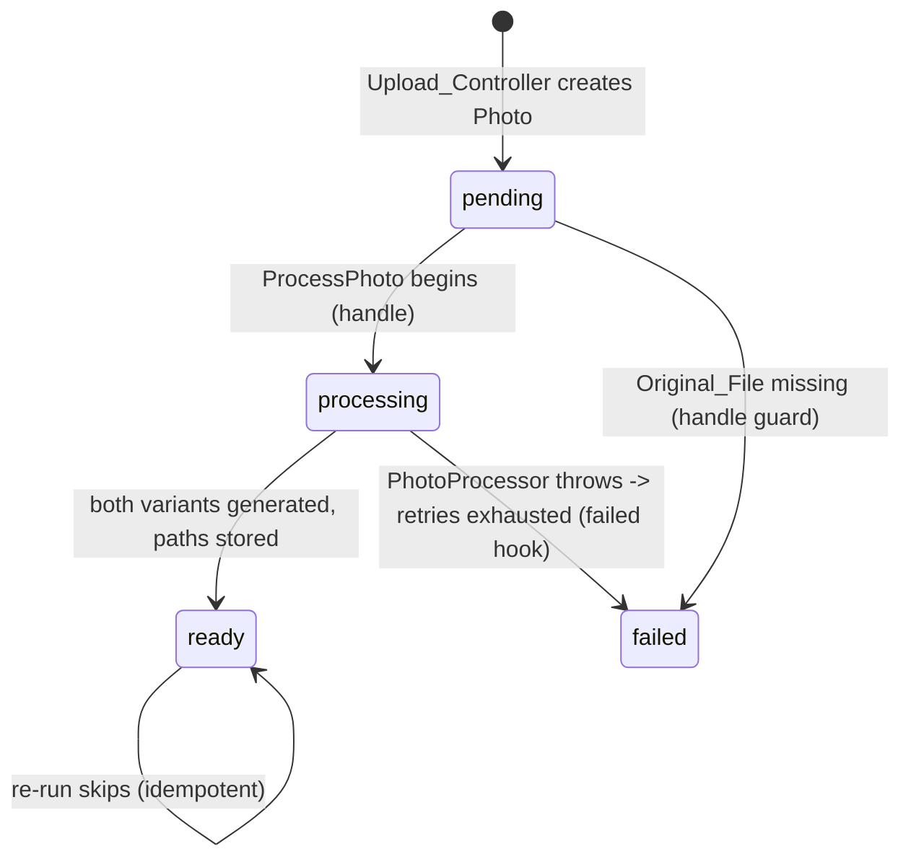

# Design Document

## Overview

Phase 8 moves image processing out of the synchronous HTTP upload request into a per-photo Laravel queued job running on the already-configured `database` queue. In Phase 7 the guest upload controller stored each original and then ran `App\Services\PhotoProcessor::process(...)` inline, blocking the response while large images were optimized. Phase 8 keeps everything about the upload except the processing step:

- **Upload** stores the `Original_File`, creates the `Photo` as `pending`, dispatches one `App\Jobs\ProcessPhoto` per photo, and returns immediately with an "uploaded and being processed" message. No `PhotoProcessor` injection, no try/catch, no `$failures` counter.
- **Job** (`ProcessPhoto`) runs on a worker: it re-fetches the photo by id, sets it `processing`, verifies the original exists, calls the existing `PhotoProcessor` (reused, not duplicated), stores the returned paths, and sets the photo `ready`. On a thrown error Laravel retries up to `tries = 3` with `backoff()` of `[10, 30, 60]` seconds; after retries are exhausted the `failed()` hook marks the photo `failed`, deletes any partial processed files, and logs the failure.
- **Gallery** is unchanged — `PublicGalleryController@show` already lists only `ready` photos, so `pending`, `processing`, and `failed` photos never appear.
- **Frontend** changes one line of copy in `PhotoUploader.tsx` to reflect asynchronous processing. No WebSockets, polling, or broadcasting.

Constraints honored throughout: the database queue and the `jobs`/`job_batches`/`failed_jobs` tables already exist (migration `0001_01_01_000002_create_jobs_table.php`), `config/queue.php` default is `database`, and the failed driver is `database-uuids`. **No new migration, package, or queue configuration change is introduced, and `PhotoProcessor` is reused as-is.**

## Architecture

The request path becomes fast and side-effect-light; the heavy work moves to a worker process that consumes the database queue.

```mermaid
flowchart TD
    subgraph Request["HTTP request (fast, non-blocking)"]
        A[Guest submits photos] --> B[StorePhotosRequest validates]
        B --> C{Active event for slug?}
        C -- no --> C404[404]
        C -- yes --> D{upload_enabled?}
        D -- no --> D403[403]
        D -- yes --> E[For each file]
        E --> F[Store Original_File on public disk]
        F --> G[Photo::create status = pending]
        G --> H[ProcessPhoto::dispatch photo id]
        H --> E
        E -->|loop done| I[Redirect back: uploaded and being processed]
    end

    subgraph Queue["Queue System (database connection)"]
        J[(jobs table)]
        K[(failed_jobs table)]
    end

    H -. enqueue .-> J

    subgraph Worker["php artisan queue:work"]
        L[Pick up ProcessPhoto] --> M[Photo::find id]
        M -->|null| Mn[return no-op]
        M -->|ready with both paths| Ms[return skip]
        M -->|otherwise| N{Original_File exists?}
        N -- no --> No[status = failed, return]
        N -- yes --> O[status = processing]
        O --> P[PhotoProcessor::process]
        P --> Q[store paths, status = ready]
        P -. throws .-> R[exception propagates]
        R --> S{attempts < tries?}
        S -- yes --> Sb[retry after backoff 10/30/60]
        Sb --> L
        S -- no --> T[failed hook: status = failed,\ndelete partial files, log]
        T --> K
    end

    J --> L

    subgraph Gallery["Gallery (unchanged)"]
        U[PublicGalleryController@show] --> V[where status = ready]
        V --> W[Only ready photos rendered]
    end
```

Key architectural decisions and rationale:

- **Per-photo jobs, not a batch.** Each photo is processed by its own job so photos succeed or fail independently; one bad file never blocks the rest. (Requirement 2.)
- **Job carries the photo id (int), not the full model.** With `SerializesModels`, passing the `Photo` model would re-fetch it at deserialize time and throw `ModelNotFoundException` if the photo was deleted, which the queue would treat as a failure. Passing the primitive id and calling `Photo::find($this->photoId)` inside `handle()` lets the job satisfy the idempotency rule "return quietly if the photo no longer exists." (Requirement 6.1.)
- **Reuse `PhotoProcessor` verbatim.** The service already performs decode → scale-down → WebP encode → store and throws on failure. The job resolves it from the container and calls `process(...)`; no image logic is duplicated. (Requirement 3.5.)
- **Retries with finite backoff.** `tries = 3` and `backoff()` `[10, 30, 60]` give transient errors a bounded chance to recover without retrying forever. (Requirement 5.)
- **No realtime layer.** The gallery already shows ready-only, and guests get a "being processed" message. There is no polling or broadcasting to add. (Requirements 7, 8.)

## Components and Interfaces

### `App\Jobs\ProcessPhoto` (new)

Processes exactly one photo. Uses the classic explicit trait set for clarity (this is Laravel's `ShouldQueue` contract with `Dispatchable`, `InteractsWithQueue`, `Queueable`, `SerializesModels`). The constructor stores the photo **id** (primitive) so a deleted photo does not break deserialization.

```php
<?php

namespace App\Jobs;

use App\Models\Photo;
use App\Services\PhotoProcessor;
use Illuminate\Bus\Queueable;
use Illuminate\Contracts\Queue\ShouldQueue;
use Illuminate\Foundation\Bus\Dispatchable;
use Illuminate\Queue\InteractsWithQueue;
use Illuminate\Queue\SerializesModels;
use Illuminate\Support\Facades\Log;
use Illuminate\Support\Facades\Storage;
use Throwable;

class ProcessPhoto implements ShouldQueue
{
    use Dispatchable, InteractsWithQueue, Queueable, SerializesModels;

    /**
     * Maximum processing attempts before the job is marked failed.
     */
    public int $tries = 3;

    /**
     * Carry the primitive id (not the model) so a deleted photo does not
     * break job deserialization; the model is re-fetched in handle().
     */
    public function __construct(public int $photoId)
    {
    }

    /**
     * Finite retry backoff in seconds between attempts.
     *
     * @return array<int, int>
     */
    public function backoff(): array
    {
        return [10, 30, 60];
    }

    /**
     * Process a single photo: original -> optimized + thumbnail -> ready.
     * Idempotent and safe to run more than once.
     */
    public function handle(PhotoProcessor $processor): void
    {
        $photo = Photo::find($this->photoId);

        // 6.1 Photo no longer exists: quiet no-op.
        if (! $photo) {
            return;
        }

        // 6.2 Already fully processed: skip re-processing.
        if ($photo->status === Photo::STATUS_READY
            && $photo->optimized_path
            && $photo->thumbnail_path) {
            return;
        }

        // 6.3 Original missing: mark failed, do not crash.
        if (! Storage::disk('public')->exists($photo->original_path)) {
            $photo->update(['status' => Photo::STATUS_FAILED]);

            return;
        }

        // 3.1 Begin processing.
        $photo->update(['status' => Photo::STATUS_PROCESSING]);

        // 3.2/3.5 Reuse PhotoProcessor; it overwrites variant files in place
        // (6.4) and throws on failure (4.1 -> propagates to the queue).
        $paths = $processor->process(
            $photo->original_path,
            $photo->event->uuid,
            $photo->uuid,
        );

        // 3.3/3.4 Store paths and mark ready only after both variants exist.
        // 6.5 Updates the existing row; no new Photo is created.
        $photo->update([
            'optimized_path' => $paths['optimized_path'],
            'thumbnail_path' => $paths['thumbnail_path'],
            'status'         => Photo::STATUS_READY,
        ]);
    }

    /**
     * Runs after retries are exhausted (4.2-4.4). Marks the photo failed,
     * removes any partial processed files, and logs without leaking detail.
     */
    public function failed(?Throwable $exception): void
    {
        $photo = Photo::find($this->photoId);

        if (! $photo) {
            return;
        }

        // Delete partial processed files if the event association is present.
        if ($photo->event) {
            Storage::disk('public')->delete([
                "events/{$photo->event->uuid}/optimized/{$photo->uuid}.webp",
                "events/{$photo->event->uuid}/thumbnails/{$photo->uuid}.webp",
            ]);
        }

        $photo->update(['status' => Photo::STATUS_FAILED]);

        // Logged server-side only; never surfaced to guests.
        Log::error('Photo processing failed', [
            'photo_id'  => $this->photoId,
            'exception' => $exception?->getMessage(),
        ]);
    }
}
```

Interface summary:

| Member | Signature | Purpose | Requirements |
| --- | --- | --- | --- |
| `$tries` | `public int = 3` | Max attempts | 5.1, 5.3 |
| `__construct` | `(public int $photoId)` | References exactly one photo by id | 2.3, 6.1 |
| `backoff()` | `: array` → `[10,30,60]` | Finite retry spacing | 5.2 |
| `handle()` | `(PhotoProcessor $processor): void` | Process one photo, idempotently | 3.1–3.5, 6.1–6.5 |
| `failed()` | `(?Throwable): void` | Mark failed, clean up, log | 4.2–4.4 |

### `App\Http\Controllers\PublicPhotoUploadController@store` (revised)

Drops the `PhotoProcessor` injection, the try/catch, and the `$failures` counter. Stores the original, creates the photo as `pending`, dispatches the job, and returns a fast "being processed" message. Event resolution, `abort_if` for disabled uploads, validation, original storage, and server-authoritative fields are unchanged. `getimagesize` is kept — dimensions are known before processing and remain useful metadata.

```php
<?php

namespace App\Http\Controllers;

use App\Http\Requests\StorePhotosRequest;
use App\Jobs\ProcessPhoto;
use App\Models\Event;
use App\Models\Photo;
use Illuminate\Http\RedirectResponse;
use Illuminate\Support\Facades\Storage;
use Illuminate\Support\Str;

class PublicPhotoUploadController extends Controller
{
    /**
     * Accept guest photo uploads for an active, upload-enabled event.
     *
     * All trust-sensitive values (event association, storage path/filename,
     * mime type, status) are server-determined. Processing is dispatched to
     * a background job; the request returns without generating variants.
     */
    public function store(StorePhotosRequest $request, string $slug): RedirectResponse
    {
        $event = Event::query()
            ->where('slug', $slug)
            ->where('status', 'active')
            ->firstOrFail(); // 1.5: 404 when no matching active event

        abort_if(! $event->upload_enabled, 403, 'Photo uploads are currently closed.'); // 1.6

        $disk = Storage::disk('public');

        foreach ($request->file('photos') as $file) {
            $uuid = (string) Str::uuid();
            $ext  = strtolower($file->getClientOriginalExtension() ?: $file->extension());
            $path = "events/{$event->uuid}/originals/{$uuid}.{$ext}";

            // 1.1: store the original before dispatching any job.
            $disk->putFileAs("events/{$event->uuid}/originals", $file, "{$uuid}.{$ext}");

            $absolute = $disk->path($path);
            $size     = @getimagesize($absolute);
            $width    = $size[0] ?? null;
            $height   = $size[1] ?? null;
            $mime     = $size['mime'] ?? $file->getMimeType();

            // 1.2/1.7: create the row pending, from server-determined values.
            $photo = Photo::create([
                'event_id'          => $event->id,
                'uuid'              => $uuid,
                'original_filename' => $file->getClientOriginalName(),
                'original_path'     => $path,
                'mime_type'         => $mime,
                'file_size'         => $file->getSize(),
                'width'             => $width,
                'height'            => $height,
                'status'            => Photo::STATUS_PENDING,
            ]);

            // 2.1/2.2/2.3: one job per photo, enqueued on the database queue.
            ProcessPhoto::dispatch($photo->id);
        }

        // 1.4: fast success response; no synchronous processing (1.3).
        return back()->with(
            'success',
            'Your photos have been uploaded and are being processed.'
        );
    }
}
```

### `App\Http\Controllers\PublicGalleryController@show` (unchanged)

Already filters `->where('status', Photo::STATUS_READY)`. No change. Listed here only to confirm the ready-only guarantee still holds and covers Requirement 7.

### `resources/js/components/PhotoUploader.tsx` (copy change only)

The success block currently renders:

```tsx
{succeeded && (
    <p className="text-center text-sm text-foreground">
        Your photos have been added to the event!
    </p>
)}
```

Change the copy to reflect asynchronous processing (Requirement 8.1); no logic, polling, or broadcasting is added (8.2):

```tsx
{succeeded && (
    <p className="text-center text-sm text-foreground">
        Your photos have been uploaded and are being processed. They may take a moment to appear.
    </p>
)}
```

## Data Flow / Status Lifecycle

No schema change. The existing `Photo` status constants carry the lifecycle:



- `pending` — set at upload, before any processing. While no worker runs, photos stay here (Requirement 9.3).
- `processing` — set when `handle()` begins work.
- `ready` — set after both `Optimized_Variant` and `Thumbnail_Variant` are generated and their paths stored. Only `ready` photos appear in the gallery.
- `failed` — set when the original is missing, or after retries are exhausted; partial files are removed and the failure is logged.

The job payload carries `photoId` (int), not the serialized `Photo` model, which is what makes the "photo gone → no-op" path clean instead of a deserialization failure.

## Correctness Properties

*A property is a characteristic or behavior that should hold true across all valid executions of a system — essentially, a formal statement about what the system should do. Properties serve as the bridge between human-readable specifications and machine-verifiable correctness guarantees.*

Property-based testing applies here because the upload/dispatch and job-processing logic is our own code with clear input/output behavior over a large input space (any number of images, any content, present/missing/deleted photos, success/failure). Infrastructure facts (config values, `failed_jobs` recording) are covered by integration/smoke tests in the Testing Strategy, not by properties.

### Property 1: Asynchronous upload invariant

*For any* valid upload of one or more images to an active, upload-enabled event, when the queue is faked so no job runs, every created `Photo` SHALL have status `pending`, a null `optimized_path`, and a null `thumbnail_path`, its `Original_File` SHALL exist on disk, and no `Optimized_Variant` or `Thumbnail_Variant` file SHALL exist.

**Validates: Requirements 1.1, 1.2, 1.3, 9.3**

### Property 2: One job per photo

*For any* valid upload containing N images, exactly N `ProcessPhoto` jobs SHALL be enqueued, and each enqueued job SHALL reference exactly one distinct `Photo` id.

**Validates: Requirements 2.1, 2.2, 2.3**

### Property 3: Job success produces ready photo with both variants

*For any* `pending` `Photo` whose `Original_File` exists, executing `ProcessPhoto` SHALL invoke `PhotoProcessor`, store both the optimized and thumbnail paths on the `Photo`, set status to `ready`, and result in both the `Optimized_Variant` and `Thumbnail_Variant` existing on disk as WebP files.

**Validates: Requirements 3.1, 3.2, 3.3, 3.4, 3.5**

### Property 4: Processing errors propagate

*For any* `Photo` whose `PhotoProcessor` invocation throws, executing `ProcessPhoto` SHALL allow the exception to propagate rather than swallowing it, so the queue can record the failure.

**Validates: Requirements 4.1**

### Property 5: Failure marks failed, cleans up, and never leaks

*For any* `Photo` whose job has exhausted its retries, invoking the `failed()` hook SHALL set the `Photo` status to `failed`, delete every `Partial_Processed_File` for that photo, and produce no guest-visible exception detail.

**Validates: Requirements 4.2, 4.3, 4.4**

### Property 6: Re-processing is idempotent

*For any* `Photo` processed successfully more than once, each run SHALL overwrite the `Optimized_Variant` and `Thumbnail_Variant` at the same paths, leave the photo `ready`, and leave the total `Photo` record count unchanged (no duplicate rows).

**Validates: Requirements 6.4, 6.5**

### Property 7: Missing photo is a no-op

*For any* `photoId` that references no existing `Photo`, executing `ProcessPhoto` SHALL return without throwing and SHALL write no files.

**Validates: Requirements 6.1**

### Property 8: Already-ready photo is skipped

*For any* `Photo` already in status `ready` with both stored paths, executing `ProcessPhoto` SHALL not re-invoke `PhotoProcessor` and SHALL leave the photo's paths and status unchanged.

**Validates: Requirements 6.2**

### Property 9: Missing original marks failed without crashing

*For any* `Photo` whose `Original_File` is absent from disk, executing `ProcessPhoto` SHALL set the status to `failed` and SHALL not throw an unhandled error.

**Validates: Requirements 6.3**

### Property 10: Gallery shows only ready photos

*For any* set of photos on an event spanning `pending`, `processing`, `ready`, and `failed`, the gallery listing SHALL include exactly the `ready` photos and exclude all others.

**Validates: Requirements 7.1, 7.2**

### Property 11: Per-photo independence

*For any* group of dispatched `ProcessPhoto` jobs in which some fail (e.g., a missing original), the jobs for the remaining valid photos SHALL still reach status `ready`.

**Validates: Requirements 2.1, 10.7**

## Error Handling

| Condition | Handling | Photo outcome | Guest-visible? | Requirements |
| --- | --- | --- | --- | --- |
| Photo deleted before the job runs | `Photo::find` returns null; `handle()` returns; `failed()` also guards on null | none (already gone) | no | 6.1 |
| `Original_File` missing when job runs | Guard in `handle()` marks failed and returns | `failed` | no | 6.3 |
| Already `ready` with both paths | Idempotency guard returns early | unchanged `ready` | no | 6.2 |
| `PhotoProcessor` throws | Exception propagates; queue retries per `tries`/`backoff` | `processing` until retries exhausted | no | 4.1, 5.1–5.3 |
| Retries exhausted | `failed()` hook: status `failed`, delete partial files, `Log::error` | `failed` | no (logged only) | 4.2, 4.3, 4.4 |
| Retries exhausted (queue side) | Queue records a row in `failed_jobs` (`database-uuids` driver) | `failed` | no | 4.5, 9.2 |
| No worker running | Jobs remain enqueued in `jobs` table | `pending` (or `processing` if interrupted mid-run) | photos simply not yet in gallery | 9.3 |
| Event association missing in `failed()` | Cleanup guarded by `if ($photo->event)`; still marks `failed` and logs | `failed` | no | 4.2, 4.4 |

Guests never see exception detail: the controller returns a friendly redirect regardless, and all failure information stays in logs and the `failed_jobs` table.

## Testing Strategy

Tests use PHPUnit with `#[Test]`, `RefreshDatabase`, `Storage::fake('public')`, `Queue::fake()`/`Bus::fake()` where dispatch is under test, `AssertableInertia` for the gallery, and the `Event`/`Photo` factories. `gd`, `exif`, and `webp` are available, so job-execution tests synthesize real images with GD (as the Phase 7 tests do) and run genuine decode/encode.

### Dual approach

- **Property tests** (min. 100 iterations each) validate the universal properties above. Tag each with `Feature: queue-background-processing, Property {n}: {property text}` and reference the design property. Randomize over file count, image dimensions/format, and photo state (present/missing/deleted, pending/processing/ready/failed).
- **Unit/example and integration tests** cover concrete constants, config facts, and Laravel queue machinery that do not vary meaningfully with input.

### New test file(s)

Add `tests/Feature/QueuedPhotoProcessingTest.php` (a single dedicated `ProcessPhotoJobTest.php` may be split out for job-only cases). Coverage:

- **Upload dispatch (Property 1, 2)** — `Queue::fake()`; upload N valid images; assert `Photo::count() === N`, every photo `pending` with null `optimized_path`/`thumbnail_path`, each `Original_File` exists, no variant files exist; `Queue::assertPushed(ProcessPhoto::class, N)`; capture pushed jobs and assert each carries a distinct single `photoId`.
- **No synchronous processing (Property 1)** — with `Queue::fake()` (job never runs), assert immediately after upload the photo is `pending` and `optimized_path` is null. This is the concrete form of Requirement 10.2.
- **Job success (Property 3)** — create a `pending` `Photo` with a real GD-synthesized original on the faked public disk, run the job via `ProcessPhoto::dispatchSync($photo->id)` or `(new ProcessPhoto($photo->id))->handle(app(PhotoProcessor::class))`; assert status `ready`, both paths set to the expected `events/{eventUuid}/optimized|thumbnails/{photoUuid}.webp`, both files exist and are `image/webp`.
- **Reuse PhotoProcessor (Property 3, example 3.5)** — bind a spy/subclass `PhotoProcessor` in the container; run the job; assert `process()` was called with the photo's `original_path`, event uuid, and photo uuid.
- **Job failure + cleanup (Property 4, 5)** — bind a throwing `PhotoProcessor`; assert `handle()` throws (4.1). Then pre-place partial variant files and call `(new ProcessPhoto($photo->id))->failed(new \RuntimeException('boom'))`; assert status `failed`, both variant files removed, original retained, and `session('success')`/response contains no `'boom'`. Use a `Log::spy()` to assert an error was logged.
- **Retry config (examples 5.1, 5.2)** — instantiate the job; assert `->tries === 3` and `->backoff() === [10, 30, 60]`.
- **Failed-jobs integration (5.3, 4.5, 9.2)** — one representative run through the real queue with an always-throwing processor and exhausted retries; assert a row lands in `failed_jobs`. Also assert `config('queue.default') === 'database'` and `config('queue.failed.driver') === 'database-uuids'` (smoke).
- **Idempotency (Property 6, 7, 8, 9)** — run `handle()` twice on the same valid photo → same paths, still `ready`, `Photo::count()` unchanged (6). Run `handle()` for a non-existent id → no throw, no files (7). Run `handle()` on an already-`ready` photo with a spy processor → processor not called, state unchanged (8). Run `handle()` on a `pending` photo whose original was never stored → `failed`, no throw, no variants (9).
- **Per-photo independence (Property 11)** — create 3 `pending` photos where the middle photo's original is missing; run all 3 jobs; assert the middle photo is `failed` and the other two are `ready`.
- **Gallery (Property 10)** — seed photos across all statuses on an active event; GET the gallery; use `AssertableInertia` to assert the `photos` payload count equals the `ready` count and excludes `processing`/`failed`/`pending`.

### Regression updates to existing tests

The Phase 7 tests assume synchronous `ready` after upload and must be updated to the async expectation (Requirements 10.9, 10.10). Keep the changes minimal:

- **`tests/Feature/GuestPhotoUploadTest.php`** — the upload-focused tests move to `Queue::fake()`:
  - `upload_to_active_enabled_event_succeeds_and_persists_metadata`: change the `Property 8` assertion `assertSame(Photo::STATUS_READY, $photo->status)` to `assertSame(Photo::STATUS_PENDING, $photo->status)`, and add `Queue::assertPushed(ProcessPhoto::class)`. All other assertions (event association, server-built path, filename, UUID, dimensions, original exists) stay unchanged.
  - `client_cannot_override_event_id_status_or_path`: change the expected status from `STATUS_READY` to `STATUS_PENDING`; the event-id and path assertions stay.
  - 404/403/validation/throttle tests need no change (they never reached processing).
- **`tests/Feature/ImageProcessingTest.php`** — this file exercises the actual processing outcome, so its processing assertions move to job execution rather than the upload response. Two equivalent options; prefer the first:
  - Run the job before asserting: after `$this->upload(...)`, execute the dispatched work (e.g., `Queue::fake()` is **not** used here; instead run `ProcessPhoto::dispatchSync($photo->id)` for the created photo, or fetch the pending photo and call the job's `handle`), then keep the existing `ready` + variant-file + dimension + orientation + format assertions.
  - `processing_failure_marks_failed_and_cleans_up`: keep the throwing-`PhotoProcessor` binding, but drive it through the job — after upload (photo is `pending`), run the job and invoke `failed()` (or `dispatchSync` and catch), then assert `failed`, partial files missing, original retained, and no leaked `'boom'`.

The intent: upload-focused tests use `Queue::fake` and assert dispatch + `pending`; a dedicated job test runs the real `PhotoProcessor` to assert the `ready` outcome and variant properties. No other Phase 1–7 tests are rewritten.

### Local queue operation (documentation)

Document (e.g., in the project README or spec notes) how to run the queue locally, per Requirement 9.4:

- `php artisan queue:work` — run a worker that consumes and executes `ProcessPhoto` jobs from the `database` queue.
- `php artisan queue:failed` — list jobs that failed after exhausting retries (rows in `failed_jobs`).
- `php artisan queue:retry all` — re-queue all failed jobs.

Worker-stopped behavior: while no `queue:work` process is running, dispatched jobs accumulate in the `jobs` table and their photos remain `pending` (or `processing` if a worker was interrupted mid-run). Starting a worker drains the backlog and moves photos to `ready`/`failed`.
